# StudySourceCore — Autonomous Study Asset Orchestration Engine

> **Canonical Architecture**: [`ARCHITECTURE.md`](./ARCHITECTURE.md)  
> **Product Charter**: [`PRODUCT.md`](./PRODUCT.md)  
> **Implementation Roadmap**: [`ROADMAP.md`](./ROADMAP.md)  
> **Learning Principles**: [`docs/LEARNING_PRINCIPLES.md`](./docs/LEARNING_PRINCIPLES.md)  
> **Version**: v1.0 Production Baseline  
> **Status**: Certified / Production Baseline  
> **Architecture**: 14-Agent Multi-Agent System with 6-Tier Pipeline & 3-Wave Execution

---

## What is this?

**StudySourceCore** is a production-grade, deterministic multi-agent orchestration engine that ingests authorized study sources (PDFs, textbook chapters, exam papers) and synthesizes a complete ecosystem of high-yield study deliverables in parallel — automatically.

It operates on the canonical six-tier architecture:
`AUTHORIZED SOURCE → EVIDENCE PACK → SEMANTIC LEARNING IR → PEDAGOGICAL COMPILER → RENDERERS → INDEPENDENT CERTIFICATION`.

One source in → seven parallel artifacts out.

```
Raw Source (PDF / Markdown)
        │
        ▼
┌──────────────────────────────────────────────────────────────┐
│  Parent Orchestrator — Evidence Extraction + Routing Engine  │
│  Produces: scratch/evidence-pack.md  (SHA-256 locked)        │
└────────────────────────┬─────────────────────────────────────┘
                         │
        ┌────────────────┴─────────────────┐
        ▼                                 ▼
STANDARD TRACK                    STUDYLAB TRACK
(Parallel Wave 1)                 (Parallel Wave 1)
  core-notes                        math-apkg-author
  core-basic-anki                   reasoning-apkg-author
  core-cloze-anki                   physics-numerical-apkg-author
  core-image-occlusion              chemistry-numerical-apkg-author
  core-mindmap
  core-slide-deck
        │                                 │
        └──────────────┬──────────────────┘
                       ▼
          WAVE 2: Sequential Packaging
          export_anki.js + export_studylab_procedural_anki.js
                       │
                       ▼
          WAVE 3: QA & Physical Audit
          bm-qa · bm-graph · adversarial-apkg-reviewer
                       │
                       ▼
         ✅ Verified Sibling Deliverables
```

---

## Deliverables Generated (per chapter)

| Track | Output | Format |
|---|---|---|
| Notes | `Notes/<Chapter>_Notes.md` | Obsidian Markdown + YAML frontmatter |
| Basic Flashcards | `Basic/<Chapter>_Basic.tsv` | 3-column TSV → Anki import |
| Cloze Flashcards | `Cloze/<Chapter>_Cloze.tsv` | Cloze `{{c1::}}` TSV → Anki import |
| Image Occlusion | `ImageOcclusion/<Chapter>_IO.json` | SVG bounding-box manifest |
| MindMap | `MindMap/<Chapter>_MindMap.md` | Mermaid + JSON concept tree |
| Slide Deck | `SlideDeck/<Chapter>_SlideDeck.md` | Marp presentation |
| StudyLab APKG | `StudyLab/<Chapter>_StudyLab_Procedural.apkg` | Anki `.apkg` binary (Level 1–7 hints) |

---

## Repository Structure

```
StudySourceCore/
├── README.md                       ← Master repository overview and quickstart
├── PRODUCT.md                      ← Product Charter, 10 Immutable Principles, non-goals
├── ARCHITECTURE.md                 ← Canonical 6-Tier Architecture & Contract Matrix
├── ROADMAP.md                      ← Master 11-Phase Roadmap (Phases 0–10 Certified)
├── CONTRIBUTING.md                 ← Developer workflow, testing, PR guidelines
│
├── docs/                           ← Tier 1: Canonical Technical Specifications
│   ├── LEARNING_PRINCIPLES.md      ← Cognitive load, 4-stage progression, 17 dimensions
│   ├── SUBJECT_POLICIES.md         ← 9-subject artifact matrix & suppression rules
│   ├── STUDYLAB_SPECIFICATION.md   ← StudyLab procedural IR, 3-tier hints, DAGs
│   ├── KNOWLEDGE_UNITS.md          ← Knowledge Units (KU), deduplication, reservations
│   ├── VISUAL_LEARNING.md          ← 9-stage visual pipeline, IO coordinate constraints
│   ├── PROVENANCE_AND_LINEAGE.md   ← 4-tier provenance hierarchy & 11-field CLR schema
│   ├── VALIDATION_AND_CERTIFICATION.md ← 5 quality stages, 15 adversarial checks (ADV-01..15)
│   ├── ORCHESTRATION_AND_EXECUTION.md  ← Subagent DAGs, Parent Self-Execution Ban
│   ├── RENDERING_PIPELINE.md       ← 7 format renderers, Markdown projection philosophy
│   ├── ANKI_INTEGRATION.md         ← Dual APKG v1.0, Model IDs 1600000001–1600000004
│   ├── SECURITY_AND_TRUST.md       ← Zero-trust model, path traversal, injection defenses
│   ├── GOVERNANCE.md               ← Authority hierarchy, ADR protocol, single-rule ownership
│   ├── GAP_REGISTER.md             ← Authoritative register of architectural gaps & resolutions
│   ├── CURRENT_IMPLEMENTATION.md   ← Active baseline assessment & test inventory
│   ├── audits/                     ← Historical audit reports & verification proofs (11 files)
│   ├── archive/                    ← Retired drafts & archive indexes
│   └── target_architecture/        ← Forward-looking target architecture specifications
│
├── .agents/                        ← Tier 2: Machine Governance & Subagent Definitions
│   ├── README.md                   ← Agent Operations Manual
│   ├── AGENTS.md                   ← Master Subagent Registry (14 standardized profiles)
│   ├── OWNERSHIP.md                ← Single Responsibility Matrix & Single-Writer Rule
│   ├── DATA_FLOW.md                ← End-to-End Pipeline & Message Schemas
│   ├── EXECUTION_LIFECYCLE.md      ← 3-Wave Protocol, Concurrency Caps, Timeouts
│   ├── FREEZE_MAP.md               ← 5-Tier Component Governance
│   ├── DECISIONS.md                ← Architectural Decision Records (ADR-01–ADR-17)
│   ├── TROUBLESHOOTING.md          ← Diagnostic Trees for 8 Failure Classes
│   ├── SKILLS.md                   ← Skills Registry
│   ├── RESOURCES.md                ← Schemas & Contracts Index
│   ├── SCRIPTS.md                  ← Executable Scripts Registry
│   └── agents/                     ← 14 Canonical Agent Specifications
│       ├── core-notes.md
│       ├── core-basic-anki.md
│       ├── core-cloze-anki.md
│       ├── core-image-occlusion.md
│       ├── core-mindmap.md
│       ├── core-slide-deck.md
│       ├── bm-graph.md
│       ├── bm-qa.md
│       ├── math-apkg-author.md
│       ├── reasoning-apkg-author.md
│       ├── physics-numerical-apkg-author.md
│       ├── chemistry-numerical-apkg-author.md
│       ├── mold-gap-auditor.md
│       └── adversarial-apkg-reviewer.md
│
├── skills/
│   └── study-source-core/          ← StudySourceCore Engine, Tools & Subject Skills
│       ├── SKILL.md                ← Master orchestration skill instructions
│       ├── package.json            ← Dependencies & 27-suite test harness
│       ├── resources/              ← Schemas (Draft-07), contracts, rulebooks
│       ├── scripts/                ← Packaging, validation, and orchestration engines
│       └── subject-skills/         ← 9 Subject Domain Skills
│
├── Study Materials/                ← Production study vault deliverables (Notes, TSV, APKG)
└── scratch/                        ← Ephemeral evidence packs, IR artifacts, checkpoints
```

---

## The 14 Agents

StudySourceCore coordinates **14 specialized, single-responsibility subagents** across 3 operational classes.

### Generic Content Specialists (Wave 1)

| Agent | Deliverable | Suppression Code |
|---|---|---|
| `core-notes` | Obsidian Markdown notes with YAML frontmatter | — |
| `core-basic-anki` | Atomic Q&A flashcards (TSV) | `ZERO_BASIC_CANDIDATES` |
| `core-cloze-anki` | Cloze deletion flashcards (TSV) | `ZERO_CLOZE_CANDIDATES` |
| `core-image-occlusion` | SVG bounding-box IO manifest | `NO_IO_CANDIDATES` |
| `core-mindmap` | Mermaid mindmap + JSON tree | `NO_RELATIONAL_TOPOLOGY` |
| `core-slide-deck` | Marp presentation deck | `DECK_WORTHINESS_BELOW_THRESHOLD` |

### StudyLab Procedural Specialists (Wave 1)

| Agent | Domain | Suppression Code |
|---|---|---|
| `math-apkg-author` | 59 Math topics — coprime constraints, Solution DAGs, 3-tier hints | `ZERO_MATH_CANDIDATES` |
| `reasoning-apkg-author` | 30 Reasoning topics — syllogisms, seating, matrix puzzles | `ZERO_REASONING_CANDIDATES` |
| `physics-numerical-apkg-author` | 40 Physics topics — calculational only, 6-stage pipeline | `DESCRIPTIVE_ONLY_NO_NUMERICALS` |
| `chemistry-numerical-apkg-author` | Chemistry — stoichiometry, ICE tables, mechanisms | `DESCRIPTIVE_ROTE_NO_CALCULATIONS` |

### Downstream QA & Audit (Wave 3)

| Agent | Role |
|---|---|
| `bm-graph` | Vault knowledge graph — Obsidian cross-note Wikilinks |
| `bm-qa` | Cross-artifact factual consistency audit |
| `mold-gap-auditor` | Contract registry audit (REUSE / EXTEND / CREATE) |
| `adversarial-apkg-reviewer` | 15-point attack harness — DAG topology, hint leaks, MCQ invariants |

---

## Core Architectural Invariants

1. **Single Source of Truth** — All generation derives from one SHA-256-locked `evidence-pack.md`. No subagent re-parses raw PDFs.
2. **Single-Writer Rule** — Exactly one agent owns each deliverable. No shared writes.
3. **Parent Self-Execution Ban** — The orchestrator coordinates & gates, never authors specialist content.
4. **Deterministic Gating** — Every suppressed track emits an explicit auditable reason code. Zero silent omissions.
5. **MCQ Hard Invariant** — Every MCQ has ≥ 4 distinct options with exactly 1 correct answer, physically persisted in SQLite.
6. **Hindi-first Language Contract** — Explanatory prose is Hindi-first; technical/domain terms appear in English in parentheses.
7. **Hard Resource Limits** — Max 4 concurrent subagents; max 10 total launches per mission.
8. **Physical Completion Gates** — Artifacts must exist on disk with `size > 0`, pass AJV schema validation, and SQLite integrity checks.

---

## Prerequisites & Dependencies

Before configuring StudySourceCore, ensure your environment satisfies the following runtime requirements.

### Required Dependencies

| Dependency | Minimum Version | Recommended | Purpose |
|---|---|---|---|
| **Node.js** | `>= 18.0.0` | `v20.x` or `v22.x` (LTS) | Core engine execution, packaging pipelines, MCP server, and test harnesses |
| **npm** | `>= 9.0.0` | `v10.x+` | Skill dependency management and execution scripts |
| **Git** | `>= 2.30.0` | Latest release | Repository version control and workspace lineage tracking |

### Optional Helpers

The following tools are strictly **optional** and not required for core pipeline operation:

- **Python 3 (`>= 3.10`)**: Optional helper required *only* for standalone PDF page counting and structural outline extraction via [`skills/study-source-core/scripts/pdf_inventory.py`](skills/study-source-core/scripts/pdf_inventory.py).
- **Anki Desktop (`>= 24.x`)**: Optional GUI tool for manual inspection and study review of generated `.apkg` packages (`Study Materials/**/<Chapter>_Anki.apkg` and `Study Materials/**/StudyLab/*_StudyLab_Procedural.apkg`). Not needed for headless generation or automated verification.
- **External MCP Servers**: Optional third-party MCP servers (e.g., SQLite, Arxiv, Firecrawl) may be connected as needed, but StudySourceCore operates deterministically with its own bundled tools.

---

## Project & Workspace Setup

Google Antigravity and compatible multi-agent frameworks utilize **project-level skills** located directly within the workspace under `skills/study-source-core/`. The root workspace acts as the operational envelope, housing student deliverables in `Study Materials/` and ephemeral compilation caches in `scratch/`.

```
StudySourceCore/ (Workspace Root)
├── Study Materials/              ← Production deliverables (persisted, untouched by updates)
├── scratch/                      ← Ephemeral evidence packs, IR artifacts, checkpoints
└── skills/
    └── study-source-core/        ← Project-level skill engine (cwd for dependencies & tests)
        ├── package.json          ← Skill dependencies and test runners
        ├── scripts/              ← Packaging, validation, and MCP server tools
        └── resources/            ← Schemas, contracts, and subject domain policies
```

### Installation Steps

1. **Clone the Repository**:
   ```bash
   git clone https://github.com/naksh-07/study-source-core.git
   cd study-source-core
   ```

2. **Install Skill Engine Dependencies**:
   Install exact locked dependencies from within the core skill package directory:
   ```bash
   cd skills/study-source-core
   npm ci
   ```
   > [!NOTE]
   > Dependencies (`@modelcontextprotocol/sdk`, `ajv`, `jszip`, `sql.js`) are installed in `skills/study-source-core/node_modules/`. All package commands, test suites, and MCP tools run against this local environment.

3. **Verify Environment and Test Harness**:
   Verify your environment and run the full test suite:
   ```bash
   # Run environment diagnostics
   npm run doctor

   # Run the master automated test suite (27 test suites, 100% passing)
   npm test
   ```

---

## Environment Verification (`npm run doctor`)

StudySourceCore provides an environment diagnostic utility (`npm run doctor`) that validates your local runtime environment before executing generation or certification runs.

```bash
# From within skills/study-source-core:
npm run doctor

# Or from workspace root:
npm --prefix skills/study-source-core run doctor
```

### Diagnostic Checks Performed:
- **Node.js Runtime**: Confirms Node.js is installed and version is `>= 18.0.0` (alerts if `< 20.0.0`).
- **npm Version**: Asserts npm is `>= 9.0.0`.
- **Git Version & State**: Confirms Git is installed and working in the workspace.
- **Skill Engine Dependencies**: Validates that `skills/study-source-core/node_modules/` exists with `@modelcontextprotocol/sdk`, `ajv`, `jszip`, and `sql.js` properly installed.
- **Workspace Directories**: Confirms existence of `Study Materials/`, `scratch/`, and `skills/study-source-core/`.
- **Filesystem Permissions**: Confirms read and write access to `scratch/` and `Study Materials/`.
- **MCP Server Entry Point**: Verifies existence and syntax of [`skills/study-source-core/scripts/mcp_server.js`](skills/study-source-core/scripts/mcp_server.js).
- **Optional Helper Status**: Checks for Python 3 and Anki Desktop availability and reports non-fatal status.

---

## Model Context Protocol (MCP) Server Setup

StudySourceCore includes a native Model Context Protocol (MCP) server located at [`skills/study-source-core/scripts/mcp_server.js`](skills/study-source-core/scripts/mcp_server.js). It exposes 4 deterministic compilation, validation, and policy tools via `stdio` transport:

| MCP Tool | Description |
|---|---|
| `export_anki_package` | Compiles Basic, Cloze, and Image Occlusion flashcards into one unified standard Anki `.apkg` package. |
| `export_studylab_procedural_package` | Compiles STEM StudyLab practice questions, solution DAGs, and 3-tier progressive hints into an interactive procedural `.apkg` package. |
| `validate_artifact` | Validates artifacts against pedagogical contracts (TSVs, StudyLab JSONs, LaTeX math syntax, Mermaid diagrams, APKG SQLite integrity). |
| `resolve_subject_policy` | Resolves authoritative artifact eligibility rules and domain suppressions for any academic subject. |

### Antigravity Configuration (`mcp_config.json`)

To configure the StudySourceCore MCP server in Google Antigravity, add the `studysource-core` entry to your Antigravity configuration file (`mcp_config.json`):

```json
{
  "mcpServers": {
    "studysource-core": {
      "command": "node",
      "args": [
        "<ABSOLUTE_PATH_TO_REPO>/skills/study-source-core/scripts/mcp_server.js"
      ]
    }
  }
}
```

> [!IMPORTANT]
> You **must replace** `<ABSOLUTE_PATH_TO_REPO>` with the actual absolute path to your cloned repository on your local machine. Relative paths or unexpanded placeholders are not supported.

#### OS-Specific Path Examples:
- **Windows**:
  ```json
  "args": [
    "C:/Users/Suraj/Documents/Antigravity/Studycore/skills/study-source-core/scripts/mcp_server.js"
  ]
  ```
- **macOS / Linux**:
  ```json
  "args": [
    "/Users/username/workspace/study-source-core/skills/study-source-core/scripts/mcp_server.js"
  ]
  ```

### Claude Desktop Configuration

For Claude Desktop, add the same configuration block to `claude_desktop_config.json`:
- **Windows**: `%APPDATA%\Claude\claude_desktop_config.json`
- **macOS**: `~/Library/Application Support/Claude/claude_desktop_config.json`

```json
{
  "mcpServers": {
    "studysource-core": {
      "command": "node",
      "args": [
        "<ABSOLUTE_PATH_TO_REPO>/skills/study-source-core/scripts/mcp_server.js"
      ]
    }
  }
}
```

### Verifying the MCP Server

You can verify that the MCP server initializes correctly and exposes all 4 tools by executing the built-in MCP test client:

```bash
cd skills/study-source-core
node scripts/test_mcp_server.js
```

Expected verification output:
```
=== Testing StudySourceCore MCP Server ===
Connecting to MCP Server via stdio transport...
Connected successfully!

[Test 1] Listing available tools...
Discovered tools: [ 'export_anki_package', 'export_studylab_procedural_package', 'validate_artifact', 'resolve_subject_policy' ]
✅ Tool discovery test passed!
...
🎉 ALL MCP TESTS PASSED SUCCESSFULLY!
```

---

## Quickstart & Verification Commands

All core commands are executed from `skills/study-source-core`:

```bash
# Navigate to core engine skill
cd skills/study-source-core

# Run master test suite (27 suites, 100% passing)
npm test

# Run standalone 4-Gate Adversarial Certification CLI on a target chapter
npm run certify -- "Study Materials/Math/LCM-HCF"

# Run Milestone 4 Packaging & Model Isolation verification suite
npm run test:milestone4

# Run Phase 10 Antigravity Host Adapter, Concurrency & Recovery test suite
npm run test:phase10

# Test Model Context Protocol (MCP) server
node scripts/test_mcp_server.js
```

---

## Lifecycle Management

```mermaid
flowchart TD
    subgraph Update ["Safe Update Lifecycle"]
        U1["git fetch && git pull"] --> U2["cd skills/study-source-core && npm ci"]
        U2 --> U3["npm run doctor"]
        U3 --> U4["npm test"]
        U4 --> U5["Study Materials/ untouched ✅"]
    end

    subgraph Teardown ["Safe Uninstall Lifecycle"]
        T1["Backup Study Materials/ & *.apkg"] --> T2["Remove studysource-core from mcp_config.json"]
        T2 --> T3["Remove scratch/* transients"]
        T3 --> T4["Remove repository clone"]
        T4 --> T5["Other Antigravity skills unaffected ✅"]
    end
```



### Safe Update Lifecycle

To safely update StudySourceCore when upstream updates or schema improvements are released:

1. **Fetch and Pull Latest Changes**:
   ```bash
   git fetch origin
   git pull origin main
   ```
2. **Re-sync Locked Dependencies**:
   ```bash
   cd skills/study-source-core
   npm ci
   ```
3. **Run Diagnostic Verification**:
   ```bash
   npm run doctor
   ```
4. **Run Regression Suites**:
   ```bash
   npm test
   ```

> [!NOTE]
> **Zero User Deliverable Impact**: All generated study deliverables in `Study Materials/` (Notes, TSVs, APKGs, Image Occlusions) remain **completely untouched** during git pulls and npm updates. Skills, schemas, and validators update in-place within `skills/study-source-core/`.

---

### Safe Uninstall & Teardown Lifecycle

To safely decommission or uninstall StudySourceCore:

1. **Back Up Deliverables**: Copy your generated notes and packages from `Study Materials/` to your backup location or personal Obsidian/Anki vaults:
   ```bash
   # Backup study vault deliverables
   cp -r "Study Materials" /path/to/safe/backup/
   ```
2. **Remove MCP Server Configuration**: Delete the `"studysource-core"` block from your Antigravity or Claude Desktop `mcp_config.json`.
3. **Clean Scratch Directory**: Remove temporary execution state and cache:
   ```bash
   rm -rf scratch/*
   ```
4. **Remove Repository Clone**: Delete the cloned `study-source-core` repository directory.

> [!IMPORTANT]
> **Blast Radius Guarantee**: Deleting StudySourceCore will **not** modify, overwrite, or delete any unrelated Antigravity skills, global agent configurations, or other MCP servers registered in your system.

---

### Optional Global Usage Model

For advanced multi-project setups where you want to access StudySourceCore tools across multiple workspaces:

- **Single Canonical Clone**: Maintain **one canonical clone** of StudySourceCore at a stable file system location (e.g. `C:/tools/StudySourceCore` or `~/tools/study-source-core`).
- **Global MCP Registration**: Register that single repository's `skills/study-source-core/scripts/mcp_server.js` using its absolute path in your global `mcp_config.json`.
- **Target Workspace Flexibility**: The MCP tools accept absolute paths (`chapterDir`, `targetPath`, `artifactPath`), enabling seamless compilation and validation across multiple project directories or external Obsidian vaults without duplicating the engine.
- **Canonical Source of Truth**: The StudySourceCore repository remains the single authoritative source of truth for all tools, contracts, and subject skills.

---

## Key Design Decisions

See [`DECISIONS.md`](./DECISIONS.md) for the full Architectural Decision Record log (ADR-01 to ADR-17).

| ADR | Decision |
|---|---|
| ADR-01 | SHA-256 Evidence Lineage — single immutable evidence pack |
| ADR-02 | Single-Writer Rule & Parent Self-Execution Ban |
| ADR-03 | 3-Wave Pipeline with hard concurrency caps ($\le 4$) |
| ADR-04 | Deterministic gating with auditable suppression codes |
| ADR-05 | Hard layer isolation — SQLite / APKG / frontend runtimes |
| ADR-06 | Native Level 1-7 StudyLab first-class integration |
| ADR-07 | Source-first practice hierarchy (`authentic_pyq ≻ curated ≻ derived ≻ synthetic`) |
| ADR-08 | MCQ Hard Invariant ($\ge 4$ options, 1 correct, SQLite-persisted) |
| ADR-09 | 1-retry targeted correction with blast-radius isolation |
| ADR-10 | Physical completion gating + Hindi-first dual-language contract |
| ADR-11 | Canonical 6-Tier Pipeline & Semantic Learning IR Decoupling |
| ADR-12 | Preservation & Normalization of 17 Procedural Dimensions |
| ADR-13 | 4-Stage Procedural Scaffolding & Interleaving Boundary |
| ADR-14 | Dual APKG Architecture for v1.0 / Unified Target for v1.1 |
| ADR-15 | Fail-Closed Visual Learning Policy (`NO_APPROVED_ASSET`) |
| ADR-16 | Content Lineage Record (CLR) Cryptographic Tracing |
| ADR-17 | Scope Boundaries & Deferred Runtimes (SQLite DB, Web UI post-v1.0) |

---

## Operational Documents

| Document | Purpose |
|---|---|
| [`AGENTS.md`](./AGENTS.md) | Master registry of all 14 agents (14-section standard spec) |
| [`OWNERSHIP.md`](./OWNERSHIP.md) | Single Responsibility Matrix — who writes what |
| [`DATA_FLOW.md`](./DATA_FLOW.md) | End-to-end 6-stage transformation pipeline & message schemas |
| [`EXECUTION_LIFECYCLE.md`](./EXECUTION_LIFECYCLE.md) | 3-Wave protocol, concurrency rules, timeout budgets |
| [`FREEZE_MAP.md`](./FREEZE_MAP.md) | 5-Tier governance — what is FROZEN vs MUTABLE |
| [`TROUBLESHOOTING.md`](./TROUBLESHOOTING.md) | Diagnostic trees for 8 failure classes |
| [`SCRIPTS.md`](./SCRIPTS.md) | CLI script reference with exit codes & usage |
| [`RESOURCES.md`](./RESOURCES.md) | 38 JSON schemas and rulebooks index |
| [`skills/study-source-core/resources/workflow.md`](./skills/study-source-core/resources/workflow.md) | Full 11-phase workflow specification |

---

## Tech Stack

- **Runtime**: Node.js (ES Modules)
- **Schema Validation**: AJV v8 (Draft-07 JSON Schema)
- **APKG Compilation**: `jszip` + `sql.js` (SQLite in-process)
- **MCP Server**: `@modelcontextprotocol/sdk` — exposes `export_anki_package`, `export_studylab_procedural_package`, `validate_artifact`, `resolve_subject_policy`
- **AI Platform**: Google Antigravity (AGY) with Gemini models
- **Presentation**: Marp (Markdown to slides)
- **Vault**: Obsidian (PKM with Wikilinks)

---

## License

Private academic research tool. Not for public redistribution.

---

*Built with Google Antigravity — an autonomous agentic AI coding assistant.*
