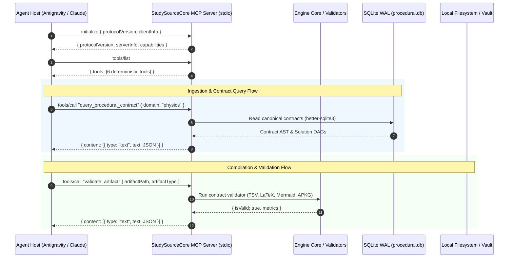

# StudySourceCore — Model Context Protocol (MCP) Server API Specification

> **Canonical Document**: `docs/MCP_SERVER_API.md`  
> **Server Version**: `1.2.0-beta.5`  
> **Transport**: Standard Input/Output (`stdio`) via JSON-RPC 2.0  
> **Protocol Specification**: Model Context Protocol (MCP) SDK `^1.30.0`  
> **Source Script**: [`skills/study-source-core/scripts/mcp_server.js`](../skills/study-source-core/scripts/mcp_server.js)  
> **Status**: Certified Production Baseline  

---

## 1. Architectural Overview

The **StudySourceCore MCP Server** exposes the deterministic toolchain of the StudySourceCore engine to AI agent hosts (such as Google Antigravity, Claude Desktop, and autonomous subagent runners).

The server enforces the **Separation of Concerns** principle:
- **LLM Agent Domain**: Conceptual analysis, narrative authoring, pedagogical reasoning, and distractor design.
- **MCP Server Tool Domain**: Cryptographic SHA-256 fingerprinting, layout-aware PDF extraction, multi-contract AST validation, SQLite WAL querying, and zero-heap binary APKG compilation.



---

## 2. Server Installation & Configuration

### 2.1 Dependencies
The server is executed under Node.js (v18.0.0+, v20+ LTS recommended) and resides in `skills/study-source-core`:
```bash
cd skills/study-source-core
npm install
```

### 2.2 Antigravity Host Configuration (`mcp_config.json`)
Register the server in your local Antigravity settings configuration:

```json
{
  "mcpServers": {
    "studysource-core": {
      "command": "node",
      "args": [
        "C:/Users/Suraj/Documents/Antigravity/Studycore/skills/study-source-core/scripts/mcp_server.js"
      ]
    }
  }
}
```

> [!IMPORTANT]
> Always supply the fully-qualified absolute path to `mcp_server.js`. Forward slashes (`/`) or escaped backslashes (`\\`) must be used on Windows.

### 2.3 Claude Desktop Configuration (`claude_desktop_config.json`)
- **Windows**: `%APPDATA%\Claude\claude_desktop_config.json`
- **macOS**: `~/Library/Application Support/Claude/claude_desktop_config.json`

```json
{
  "mcpServers": {
    "studysource-core": {
      "command": "node",
      "args": [
        "/ABSOLUTE/PATH/TO/Studycore/skills/study-source-core/scripts/mcp_server.js"
      ]
    }
  }
}
```

---

## 3. Tool Reference Catalog

The server exposes 6 deterministic tools:

| # | Tool Name | Scope | Primary Function |
|---|---|---|---|
| 1 | `export_anki_package` | Packaging | Compiles Basic, Cloze, and Image Occlusion cards into a unified `.apkg`. |
| 2 | `export_studylab_procedural_package` | Packaging | Compiles STEM StudyLab practice items into a procedural `.apkg` (Model 1600000004). |
| 3 | `validate_artifact` | Quality & Linting | Asserts artifacts against 10 strict pedagogical contract types. |
| 4 | `resolve_subject_policy` | Routing | Evaluates subject $\times$ artifact eligibility and language policies. |
| 5 | `ingest_source_to_evidence_pack` | Evidence Ingestion | Ingests PDF/OCR/JSON/Markdown sources into hashed evidence packs. |
| 6 | `query_procedural_contract` | Knowledge Base | Queries canonical contracts & solution DAGs from SQLite WAL `procedural.db`. |

---

## 4. Detailed Tool Specifications

### 4.1 `export_anki_package`

Compiles all declarative cards for a chapter (Basic, Cloze, and Image Occlusion) into ONE unified Anki deck package (`<Chapter>_Anki.apkg`).

#### Input Schema
```json
{
  "type": "object",
  "properties": {
    "chapterDir": {
      "type": "string",
      "description": "Absolute path to the chapter directory containing Basic, Cloze, or ImageOcclusion artifacts."
    },
    "cleanIntermediates": {
      "type": "boolean",
      "default": true,
      "description": "Whether to clean temporary build TSVs after successful validation. Defaults to true."
    }
  },
  "required": ["chapterDir"]
}
```

#### Example Invocation
```json
{
  "name": "export_anki_package",
  "arguments": {
    "chapterDir": "C:/Users/Suraj/Documents/Antigravity/Studycore/Study Materials/Geography/Europe",
    "cleanIntermediates": true
  }
}
```

#### Return Payload
```json
{
  "success": true,
  "outputPath": "C:/Users/Suraj/Documents/Antigravity/Studycore/Study Materials/Geography/Europe/Europe_Anki.apkg",
  "notesCount": 40,
  "basicCount": 20,
  "clozeCount": 20,
  "imageOcclusionCount": 0,
  "sha256": "4a7f9b8c2d1e0f3a6b5c8d9e2f1a0b3c4d5e6f7a8b9c0d1e2f3a4b5c6d7e8f9a"
}
```

---

### 4.2 `export_studylab_procedural_package`

Compiles STEM StudyLab practice questions, solution DAGs, parameter domains, and 3-tier progressive hints into a standalone procedural `.apkg` (Model ID `1600000004`).

#### Input Schema
```json
{
  "type": "object",
  "properties": {
    "targetPath": {
      "type": "string",
      "description": "Absolute path to the chapter directory or PracticeQuestions.json file."
    },
    "problemPatternsPath": {
      "type": "string",
      "description": "Optional path to ProblemPatterns.json if not in canonical location."
    },
    "outputDir": {
      "type": "string",
      "description": "Optional output directory for the generated .apkg package."
    }
  },
  "required": ["targetPath"]
}
```

#### Example Invocation
```json
{
  "name": "export_studylab_procedural_package",
  "arguments": {
    "targetPath": "C:/Users/Suraj/Documents/Antigravity/Studycore/Study Materials/Physics/Newton-Laws-Friction/StudyLab"
  }
}
```

#### Return Payload
```json
{
  "success": true,
  "packagePath": "C:/Users/Suraj/Documents/Antigravity/Studycore/Study Materials/Physics/Newton-Laws-Friction/StudyLab/Newton-Laws-Friction_StudyLab_Procedural.apkg",
  "itemCount": 25,
  "patternsCount": 5,
  "modelId": 1600000004
}
```

---

### 4.3 `validate_artifact`

Validates an artifact against strict pedagogical contracts, structural specifications, and syntax rules. Supports 10 distinct artifact types.

#### Input Schema
```json
{
  "type": "object",
  "properties": {
    "artifactPath": {
      "type": "string",
      "description": "Absolute path to the artifact file."
    },
    "artifactType": {
      "type": "string",
      "enum": [
        "tsv",
        "studylab_procedural",
        "studylab_practice_questions",
        "studylab_question_bank",
        "image_occlusion",
        "note_contract",
        "apkg_standard",
        "apkg_studylab_levels_1_7",
        "latex",
        "mermaid"
      ],
      "description": "The type of artifact to validate."
    }
  },
  "required": ["artifactPath", "artifactType"]
}
```

#### Supported Artifact Types & Checks

| `artifactType` | Target | Validation Criteria |
|---|---|---|
| `tsv` | Anki TSV files | Strict 3-column tab-delimited format, escaped newlines/tabs, non-empty front/back. |
| `studylab_procedural` | Procedural items JSON | Ajv validation against `studylab-procedural-schema.json`, solution DAG cycles, 17 dimensions. |
| `studylab_practice_questions` | Practice questions JSON | Validates against `studylab-practice-questions-schema.json`, pattern foreign-key links. |
| `studylab_question_bank` | `Questions.md` | Non-leaking Tier 1/2 hints, 4-option MCQs, 5 pedagogical dimensions, question density ($\ge 15$). |
| `image_occlusion` | `*_IO.json` | Coordinates within normalized $[0..100]$, max 15 regions, non-empty labels. |
| `note_contract` | Obsidian Notes (`*.md`) | YAML frontmatter, 10 mandatory pedagogical sections, word count threshold ($\ge 400$). |
| `apkg_standard` | `.apkg` ZIP binary | SQLite schema integrity, Models 1600000001–1600000003 presence, valid cards. |
| `apkg_studylab_levels_1_7` | Procedural `.apkg` | Level 1–7 hint card expansion, Model 1600000004 schema, zero missing fields. |
| `latex` | Math in Markdown/JSON | Balanced math delimiters (`$...$`, `$$...$$`), valid LaTeX syntax commands. |
| `mermaid` | MindMaps / Diagrams | Parseable Mermaid syntax, minimum hierarchy depth ($\ge 2$), valid root node. |

#### Example Invocation
```json
{
  "name": "validate_artifact",
  "arguments": {
    "artifactPath": "C:/Users/Suraj/Documents/Antigravity/Studycore/Study Materials/Chemistry/Chemical-Equilibrium/StudyLab/Chemical-Equilibrium_Questions.md",
    "artifactType": "studylab_question_bank"
  }
}
```

#### Return Payload
```json
{
  "isValid": true,
  "questionCount": 25,
  "optionsCount": 100,
  "leaksDetected": 0,
  "dimensionsCoverage": {
    "worked_example": 5,
    "faded_completion": 5,
    "independent": 10,
    "transfer": 5
  }
}
```

---

### 4.4 `resolve_subject_policy`

Resolves authoritative artifact eligibility rules, domain suppressions, and language policies for any academic subject.

#### Input Schema
```json
{
  "type": "object",
  "properties": {
    "subjectName": {
      "type": "string",
      "description": "Canonical or alias subject name (e.g. 'Math', 'Physics', 'Biology', 'History')."
    },
    "languagePolicy": {
      "type": "string",
      "enum": ["hinglish", "en", "hi", "bilingual"],
      "description": "Optional language policy override (defaults to 'hinglish')."
    }
  },
  "required": ["subjectName"]
}
```

#### Example Invocation
```json
{
  "name": "resolve_subject_policy",
  "arguments": {
    "subjectName": "Mathematics",
    "languagePolicy": "hinglish"
  }
}
```

#### Return Payload
```json
{
  "subject": "Math",
  "aliasOf": "Mathematics",
  "languagePolicy": "hinglish",
  "artifacts": {
    "notes": true,
    "basicCards": true,
    "clozeCards": true,
    "imageOcclusion": false,
    "mindmap": true,
    "slideDeck": true,
    "proceduralQuestionBank": true,
    "proceduralApkg": false
  },
  "suppressions": {
    "imageOcclusion": "IO_NOT_APPLICABLE_FOR_PURE_MATH",
    "proceduralApkg": "PROCEDURAL_APKG_TEMPORARILY_SUSPENDED"
  }
}
```

---

### 4.5 `ingest_source_to_evidence_pack`

Ingests raw educational material (PDF with PyMuPDF layout analysis and OCR fallback, JSON, or Markdown) and generates a cryptographically hashed, immutable Evidence Pack (`evidence-pack.md`).

#### Input Schema
```json
{
  "type": "object",
  "properties": {
    "sourcePath": {
      "type": "string",
      "description": "Absolute path to the source PDF, JSON, or Markdown file."
    },
    "subject": {
      "type": "string",
      "description": "Subject name (e.g. 'Math', 'Physics', 'Map')."
    },
    "chapter": {
      "type": "string",
      "description": "Chapter name (e.g. 'LCM-HCF', 'Europe')."
    },
    "pageStart": {
      "type": "integer",
      "description": "Optional 1-indexed starting page for PDF extraction."
    },
    "pageEnd": {
      "type": "integer",
      "description": "Optional 1-indexed ending page for PDF extraction."
    },
    "scratchDir": {
      "type": "string",
      "description": "Optional output directory for evidence-pack.md and provenance JSON."
    }
  },
  "required": ["sourcePath", "subject", "chapter"]
}
```

#### Example Invocation
```json
{
  "name": "ingest_source_to_evidence_pack",
  "arguments": {
    "sourcePath": "C:/Users/Suraj/Documents/Antigravity/Studycore/Sources/Physics/NCERT_Class11_Ch05.pdf",
    "subject": "Physics",
    "chapter": "Newton-Laws-Friction",
    "pageStart": 1,
    "pageEnd": 24
  }
}
```

#### Return Payload
```json
{
  "status": "SUCCESS",
  "evidence_pack_id": "ep_physics_newton-laws-friction_20261001",
  "evidence_hash": "e3b0c44298fc1c149afbf4c8996fb92427ae41e4649b934ca495991b7852b855",
  "chunks_count": 42,
  "concepts_count": 18,
  "formulas_count": 12,
  "questions_count": 25,
  "markdown_path": "C:/Users/Suraj/Documents/Antigravity/Studycore/scratch/evidence-pack.md",
  "provenance_path": "C:/Users/Suraj/Documents/Antigravity/Studycore/scratch/evidence-provenance.json"
}
```

---

### 4.6 `query_procedural_contract`

Queries canonical STEM problem contracts, solution DAG molds, parameter spaces, and 3-tier hint rules from the native SQLite WAL database (`resources/procedural.db`).

#### Input Schema
```json
{
  "type": "object",
  "properties": {
    "familyId": {
      "type": "string",
      "description": "Exact contract family_id or skill_id to look up."
    },
    "domain": {
      "type": "string",
      "description": "Domain filter (e.g. 'mathematics', 'physics', 'chemistry', 'reasoning')."
    }
  }
}
```

> [!NOTE]
> Either `familyId` or `domain` must be provided.

#### Example Invocation (by Domain)
```json
{
  "name": "query_procedural_contract",
  "arguments": {
    "domain": "physics"
  }
}
```

#### Return Payload (by Domain)
```json
{
  "domain": "physics",
  "count": 4,
  "family_ids": [
    "PHYS-NLM-01-ELEVATOR-APPARENT-WEIGHT",
    "PHYS-NLM-02-INCLINED-PLANE-FRICTION",
    "PHYS-NLM-03-CONNECTED-BLOCKS-PULLEY",
    "PHYS-NLM-04-CIRCULAR-MOTION-BANKING"
  ]
}
```

#### Example Invocation (by `familyId`)
```json
{
  "name": "query_procedural_contract",
  "arguments": {
    "familyId": "PHYS-NLM-02-INCLINED-PLANE-FRICTION"
  }
}
```

#### Return Payload (by `familyId`)
```json
{
  "found": true,
  "contract": {
    "family_id": "PHYS-NLM-02-INCLINED-PLANE-FRICTION",
    "domain": "physics",
    "title": "Block on an Inclined Plane with Friction",
    "parameters": {
      "mass_kg": { "min": 2, "max": 20, "step": 1 },
      "angle_deg": { "min": 15, "max": 60, "step": 5 },
      "mu_s": { "min": 0.2, "max": 0.8, "step": 0.05 }
    },
    "solution_dag": [
      { "id": "step_1", "description": "Resolve weight into parallel and perpendicular components" },
      { "id": "step_2", "description": "Calculate normal force: N = m * g * cos(theta)" },
      { "id": "step_3", "description": "Calculate maximum static friction: f_s_max = mu_s * N" },
      { "id": "step_4", "description": "Compare downhill component with f_s_max to determine motion" }
    ],
    "hints": {
      "tier1": "Consider which force components act perpendicular to the incline versus parallel to it.",
      "tier2": "The normal force balances the perpendicular component of gravity: $N = mg \\cos\\theta$.",
      "tier3": "Static friction prevents sliding as long as $mg \\sin\\theta \\le \\mu_s N$."
    }
  }
}
```

---

## 5. Error Handling & Fail-Closed Invariants

All tools return standard MCP response containers. When a tool fails, it sets `isError: true` with a descriptive message:

```json
{
  "isError": true,
  "content": [
    {
      "type": "text",
      "text": "[Validation Error] [HINT_ANSWER_LEAKAGE_FATAL] Option text detected in Tier 2 hint: 'x = 42'"
    }
  ]
}
```

### Invariant Rules
1. **No Silent Repair**: If an artifact has syntax errors or hint answer leaks, the validator will NOT silently sanitize it; it fails closed immediately.
2. **Missing Input Failures**: Attempting to package a non-existent chapter path returns an immediate `isError: true` result rather than creating empty archives.
3. **Database Concurrency**: The SQLite driver uses Write-Ahead Logging (`WAL`) with a `5000ms` busy timeout, preventing database locked errors during concurrent subagent queries.

---

## 6. Verification & Automated Testing

You can verify the MCP server directly via its companion test client:

```bash
cd skills/study-source-core
node scripts/test_mcp_server.js
```

Or run the full 18-gate master smoke test:
```bash
npm run smoke
```
