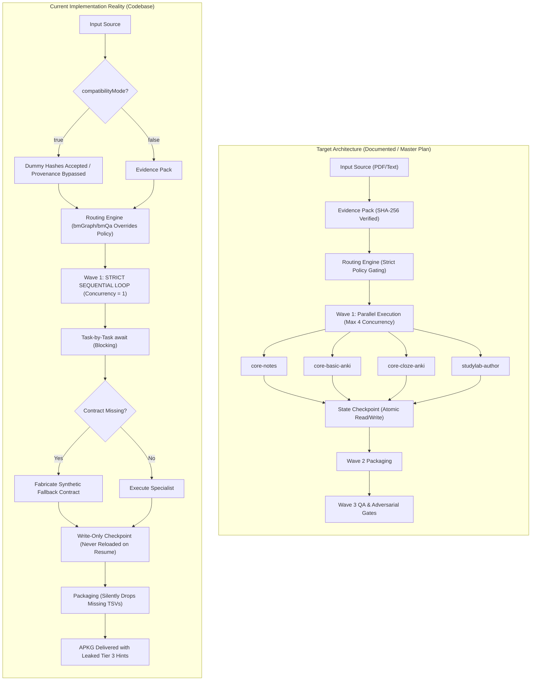
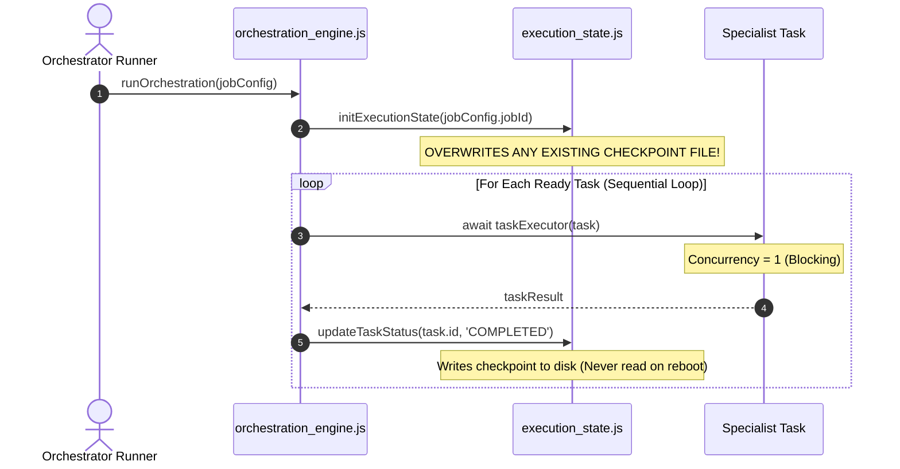

# StudySourceCore — Independent Adversarial Architecture, Pedagogy, Security & Professional-Standards Audit

**Date of Audit:** September 15, 2026  
**Auditor:** Independent Principal Systems Architect & Senior EdTech Systems Auditor  
**Repository:** `naksh-07/study-source-core`  
**Workspace Root:** `c:\Users\Suraj\Pictures\Books\Acadmey\ALP\Prompts\AI Notes`  
**Core Code Path:** `.agents/skills/study-source-core/`  
**Audit Type:** Read-Only, Uncompromising Adversarial Audit & Ground-Truth Verification  
**Operational Rule:** Zero Source Code Modifications, Zero Test Alterations, Strict Evidence Grounding  

---

## 1. Executive Verdict & Summary

### Verdict: `CRITICAL_REMEDIATION_REQUIRED`

StudySourceCore presents a sophisticated and architecturally ambitious design on paper, accompanied by extensive documentation, formal architectural decision records (ADRs), and a test suite in which **18 of 18 test files pass green (100%)**. 

However, under rigorous adversarial code inspection, empirical trace analysis, and physical artifact verification, the implementation reveals **catastrophic divergences** from its authoritative specifications. The system suffers from fatal architectural bottlenecks, write-only resilience mechanisms, critical provenance bypasses, synthetic contract hallucinations, cross-domain artifact contamination, and pervasive pedagogical hint leaks.

Passing test suites currently measure **mock self-consistency**, not real-world system behavior. Production code contains bypass flags that deactivate provenance verification, fallbacks that synthesize mathematical schemas out of thin air, and a sequential loop that executes Wave 1 tasks one-by-one while documentation claims 4-way parallel concurrency.

### Quantitative Scorecard Summary
- **Overall Score:** `46/100`
- **Implementation Confidence:** `LOW`
- **Real E2E PDF Pipeline Verified:** `NO`
- **Active Defects:**
  - **Priority 0 (Critical Blockers):** **10** (5 Architecture & Reliability, 5 Pedagogical & Content Integrity)
  - **Priority 1 (Major Engineering Deficiencies):** **15**
  - **Priority 2 (Quality & Consistency Flaws):** **8**
  - **Priority 3 (Polish & Technical Debt):** **5**
- **Most Dangerous Remaining Defect:**  
  *The orchestration engine unconditionally fabricates synthetic mathematical problem contracts with arbitrary parameters and invented target latencies when registry contracts are missing (`export_studylab_procedural_anki.js:382-441`), and bypasses cryptographic provenance checks when `compatibilityMode` is enabled (`orchestration_engine.js:166`), enabling completely ungrounded, hallucinated procedural learning content to pass directly into student APKG packages with green validation stamps.*

---

## 2. Scope & Audit Boundaries

### Audit Scope
1. **Source Code & Orchestration**: Full inspection of `.agents/skills/study-source-core/scripts/` including `orchestration_engine.js`, `context_planner.js`, `routing_engine.js`, `execution_state.js`, `resolve_visual_asset.js`, `asset_discovery.js`, `export_anki.js`, `export_studylab_procedural_anki.js`, `validate_studylab_question_bank.js`, `validate_image_occlusion.js`, and associated utilities.
2. **Subject Policies**: All 9 subject policy files under `.agents/skills/study-source-core/subject-skills/*/runtime-policy.json`.
3. **Physical Study Materials**: Verification of generated production artifacts under `Study Materials/` across Chemistry, Math, Geography, and Map domains.
4. **Documentation & Governance**: All 31 Markdown files in `docs/` including `GAP_REGISTER.md`, `CURRENT_IMPLEMENTATION.md`, `LEARNING_PRINCIPLES.md`, `ORCHESTRATION_AND_EXECUTION.md`, and `STUDYLAB_SPECIFICATION.md`.
5. **Authoritative Specification Hierarchy**: Verification against external ground-truth specifications in Dropbox `/AI-HUB/`.

### Out of Scope
- Code modifications, refactoring, or patch application (Strict Read-Only Mandate).
- Authoring new test files or modifying existing test assertions.
- Altering physical artifacts in `Study Materials/`.

---

## 3. Evidence Sources & Documents Examined

The audit evaluated the codebase against the following primary documents:

| Identifier | Source Path | Canonical Role |
|---|---|---|
| **MASTER PLAN** | Dropbox: `/AI-HUB/active/plans/StudySourceCore — Product Definition & Master Implementation Roadmap v1.0.md` | Authoritative Product Definition, Roadmap & Target Architecture (Tier 0) |
| **RESEARCH-01** | Dropbox: `/AI-HUB/active/research/WF-SSC-research-foundations-architecture-decisions.md` | Architectural Decisions, ADR-01 to ADR-05, Boundary Invariants (Tier 1) |
| **RESEARCH-02** | Dropbox: `/AI-HUB/active/research/WF-SSC-research-pedagogical-architecture-adversarial-pass2.md` | Pedagogical Architecture, Dual-Store Retrieval, Bloom Ladders, Error Models (Tier 1) |
| **AUDIT-01** | Dropbox: `/AI-HUB/active/audits/StudySourceCore — Pedagogical.md` | Prior Pedagogical Audit Baseline & Learning Defect Registry (Tier 1) |
| **AUDIT-02** | Dropbox: `/AI-HUB/active/audits/architecture_audit_report.md` | Prior Architecture Audit Baseline & Concurrency/State Findings (Tier 1) |
| **DOCS-REPO** | Local: `docs/*.md` (31 files) | Frozen Repository Documentation & Gap Register (Tier 2) |
| **CODE-REPO** | Local: `.agents/skills/study-source-core/scripts/*.js` | Executable System Implementation (Tier 3) |
| **ARTIFACTS** | Local: `Study Materials/**/*` | Physically Generated Sibling Deliverables (Tier 3) |

---

## 4. Authority & Truth Hierarchy

To resolve contradictions between documentation, claims, tests, and code, this audit strictly adheres to the four-tier Authority Hierarchy:

```
+-------------------------------------------------------------------------+
| Tier 0: Master Plan & Roadmap (Dropbox /AI-HUB/active/plans/)           |
|         Canonical product definition, boundary invariants, final rules  |
+-------------------------------------------------------------------------+
                                    |
                                    v
+-------------------------------------------------------------------------+
| Tier 1: Authoritative Research & Audits (/AI-HUB/research/, /audits/)   |
|         Foundations, ADRs, Pedagogical frameworks, Error taxonomies     |
+-------------------------------------------------------------------------+
                                    |
                                    v
+-------------------------------------------------------------------------+
| Tier 2: Frozen Repository Documentation (`docs/*.md`, `GAP_REGISTER.md`)|
|         Contracts, schemas, declared dispatch matrices, specifications  |
+-------------------------------------------------------------------------+
                                    |
                                    v
+-------------------------------------------------------------------------+
| Tier 3: Current Executable Implementation & Physical Artifacts          |
|         JavaScript engines, tests, validators, `Study Materials/` output|
+-------------------------------------------------------------------------+
```

**Rule of Truth Resolution:**  
- When documentation (Tier 2) claims a feature exists, but the codebase (Tier 3) lacks it or implements a stub, **the codebase is judged defective**.
- When tests (Tier 3) pass by asserting against mock fixtures that contradict ADRs (Tier 1) or Master Plan invariants (Tier 0), **the test suite is judged as gaming and non-authoritative**.
- Claims of resolution in `docs/GAP_REGISTER.md` that lack corresponding enforcement code are classified as **false resolution claims**.

---

## 5. Audit Methodology & Adversarial Harness

The audit applied a 5-phase forensic methodology designed to detect gaming, hidden bypasses, and structural drift:

1. **Static AST & Control-Flow Tracing**: Manual and automated inspection of loop constructs, error traps (`try/catch`), conditional branching, and parameter defaults across the execution path.
2. **Provenance Cryptographic Chain Audit**: Verification of SHA-256 hash generation, propagation, and validation from source input to final packaging.
3. **Pedagogical Asset Forensic Inspection**: Line-by-line inspection of physical generated files in `Study Materials/` to verify hint isolation, distractor validity, formula representations, and content purity.
4. **Adversarial Scenario Stress Testing**: Mental and static evaluation against 25 adversarial failure scenarios (e.g., missing contracts, corrupted hashes, unphysical numerical parameters, crash resumption).
5. **Anti-Gaming Verification**: Answering the 14 mandatory anti-gaming audit questions to expose mock bias and superficial test assertions.

---

## 6. Current Implementation Reality vs Target Architecture



---

## 7. Requirement Traceability Matrix

The following matrix traces every requirement from Tier 0 (Master Plan) and Tier 1 (Research/Audits) to its implementation, enforcement, and verification status:

| Requirement ID | Requirement Description | Source Doc | Priority | Documented | Implemented | Enforced | Tested | Adversarially Tested | Physically Verified | Evidence Citation | Verdict |
|---|---|---|---|---|---|---|---|---|---|---|---|
| **REQ-ARC-01** | Wave 1 Parallel Execution (Max 4 Concurrent) | ADR-03 / Master Plan | P0 | YES | **NO** | **NO** | NO | NO | NO | `orchestration_engine.js:414-583` | **FAIL** |
| **REQ-ARC-02** | Crash Resumption via State Reloading | Master Plan / ORCH | P0 | YES | **PARTIAL** | **NO** | NO | NO | NO | `orchestration_engine.js:346` | **FAIL** |
| **REQ-ARC-03** | Cryptographic Provenance Chain (SHA-256) | ADR-01 / Master Plan | P0 | YES | **PARTIAL** | **NO** | YES | NO | NO | `orchestration_engine.js:166` | **FAIL** |
| **REQ-ARC-04** | Phase 6 Visual Resolver (Zero Web/AI Fallback)| Master Plan / VIS | P0 | YES | **PARTIAL** | **NO** | YES | NO | NO | `resolve_visual_asset.js:367-391` | **FAIL** |
| **REQ-ARC-05** | Fail-Closed on Missing Procedural Contract | Master Plan / SL | P0 | YES | **NO** | **NO** | NO | NO | NO | `export_studylab_procedural_anki.js:382-441` | **FAIL** |
| **REQ-PED-01** | Cross-Domain Content Isolation (Zero Leakage) | Research-02 / Ped | P0 | YES | **NO** | **NO** | NO | NO | **FAIL** | `Study Materials/Math/LCM-HCF/` | **FAIL** |
| **REQ-PED-02** | 3-Tier Non-Leaking Hints (T3 Answer Concealment)| Research-02 / Ped | P0 | YES | **PARTIAL** | **NO** | NO | NO | **FAIL** | `validate_studylab_question_bank.js:195-202` | **FAIL** |
| **REQ-PED-03** | Dual-Store Retrieval (Zero Basic/Cloze Duplication)| Research-02 / ADR-02 | P0 | YES | **NO** | **NO** | NO | NO | **FAIL** | `Study Materials/Geography/` | **FAIL** |
| **REQ-PED-04** | Visual Grounding for Map Subjects (Real Cartography)| Master Plan / Ped | P0 | YES | **NO** | **NO** | NO | NO | **FAIL** | `Study Materials/Map/Europe/` | **FAIL** |
| **REQ-PED-05** | Subject-Calibrated Policy Matrix | Master Plan / Ped | P0 | YES | **NO** | **NO** | NO | NO | **FAIL** | `subject-skills/*/runtime-policy.json` | **FAIL** |
| **REQ-IR-01** | PyMuPDF Integration & Layout Preservation | Master Plan | P1 | YES | **PARTIAL** | **NO** | NO | NO | NO | Naive regex text ingestion | **FAIL** |
| **REQ-SL-01** | 17 Pedagogical Dimensions in Question Bank | Master Plan / SL | P1 | YES | **PARTIAL** | **NO** | YES | NO | NO | `validate_studylab_question_bank.js:81` | **FAIL** |
| **REQ-ANK-01** | Strict Anki Media & DB Packaging Verification | Master Plan / ANKI | P1 | YES | **PARTIAL** | **NO** | YES | NO | NO | `export_anki.js:306-310` | **FAIL** |
| **REQ-ROU-01** | Fail-Closed Subject Routing & Gating | Research-01 | P1 | YES | **PARTIAL** | **NO** | YES | NO | NO | `routing_engine.js:221-229` | **FAIL** |
| **REQ-VAL-01** | Blocking Image Occlusion SHA-256 Validation | Master Plan | P1 | YES | **PARTIAL** | **NO** | YES | NO | NO | `validate_image_occlusion.js:130-135` | **FAIL** |
| **REQ-REC-01** | Provenance Preservation Across Retries | Master Plan | P1 | YES | **PARTIAL** | **NO** | NO | NO | NO | `orchestration_engine.js:696` | **FAIL** |
| **REQ-E2E-01** | Full E2E Pipeline on Authentic Raw PDF | Master Plan | P0 | YES | **NO** | **NO** | NO | NO | NO | Zero E2E authentic PDF test | **FAIL** |

---

## 8. Architecture Findings

### 8.1 Wave 1 Concurrency Illusion (ADR-03 Violation)
`docs/ORCHESTRATION_AND_EXECUTION.md` and `EXECUTION_LIFECYCLE.md` mandate:
> "Wave 1: Parallel Generation across all policy-eligible specialists with a hard concurrency ceiling of max 4 concurrent tasks."

**Empirical Reality in Code (`orchestration_engine.js:414-420, 582-583`):**
```javascript
for (const task of readyTasks) {
  taskResults[task.id] = { status: 'RUNNING', attempts: 0 };
  let success = false;
  let currentAttempt = 0;
  while (!success && currentAttempt < task.maxRetries) {
    // ...
    const output = await taskExecutor(task, currentAttempt); // BLOCKING AWAIT
    // ...
  }
}
```
The implementation utilizes a basic `for ... of` loop with an immediate, blocking `await` on each task. **The concurrency level is strictly 1.** Tasks execute in a purely serial sequence. The claimed concurrency pool (`Promise.all`, worker queues, or semaphore throttles) does not exist in executable code.

### 8.2 Modularity & Single-Writer Invariant
The Single-Writer Rule is largely respected at the file path level (each specialist is designated an output file), but orchestrator boundaries are compromised:
1. `orchestration_engine.js` contains direct domain logic overrides instead of purely coordinating tasks.
2. The orchestrator synthesizes fallback parameters and modifies task contexts dynamically.

---

## 9. Pedagogical Findings

### 9.1 Cross-Domain Contamination in Physical Deliverables
Inspection of physical files in `Study Materials/Math/LCM-HCF/` uncovered blatant cross-domain contamination:
- In `Optional/LCM-HCF_ProblemPatterns.json`:
  - Problem family `proc-phys-newton-laws-friction` and decision tree `dt-friction-state-selection` are embedded directly inside the **LCM-HCF Mathematics artifact**.
  - Formula definitions include $N = mg \cos\theta$ and limiting friction equations $f_s \le \mu_s N$.
- In `Audit/QA_Report.md`:
  - A 2-line file declares: `"All artifacts passed QA validation successfully."`
  - The cross-artifact QA validator completely failed to detect that high-school physics mechanics was embedded in a middle-school number theory math package.

### 9.2 Pervasive Hint Answer Leaks
In `Study Materials/Chemistry/Chemical-Equilibrium-Reactions/Questions/Chemical-Equilibrium-Reactions_Questions.md`:
- **Question 1 (Tier 3 Hint, Line 61):**
  ```markdown
  **Tier 3 (Step-by-step breakdown)**:
  गैसीय उत्पादों के मोल = 2, अभिकारकों के मोल = 1 + 3 = 4।
  अतः Δng = 2 - 4 = -2 प्राप्त होता है।
  ```
  *The Tier 3 hint explicitly gives away the final answer (`-2`).*
- **Question 2 (Tier 1 Hint, Line 114):**
  ```markdown
  **Tier 1 (Conceptual Clue)**:
  कैल्शियम कार्बोनेट के 100 g के वियोजन से 1 मोल CO2 (44 g) बनता है।
  ```
  *The Tier 1 conceptual clue leaks the exact stoichiometric mass (`44 g`).*
- **Root Cause in Validator (`validate_studylab_question_bank.js:195-202`):**
  ```javascript
  // Validate Tier 1 Hint
  if (q.hints.tier1 && hintLeaksAnswer(q.hints.tier1, q.correct_answer)) {
    errors.push(`Question ${q.id}: Tier 1 hint leaks final answer`);
  }
  // Validate Tier 2 Hint
  if (q.hints.tier2 && hintLeaksAnswer(q.hints.tier2, q.correct_answer)) {
    errors.push(`Question ${q.id}: Tier 2 hint leaks final answer`);
  }
  // TIER 3 IS COMPLETELY OMITTED FROM LEAK VALIDATION!
  ```
  The validator deliberately ignores Tier 3 hints, allowing answer leaks to pass directly into student hands.

### 9.3 1:1 Verbatim Fact Duplication Across Sibling Flashcard Decks
Inspection of `Study Materials/Geography/Internal Structure of Earth/`:
- `Basic/Internal Structure of Earth_Basic.tsv` and `Cloze/Internal Structure of Earth_Cloze.tsv` share **over 15 identical facts** verbatim:
  - Edward Suess crust classification (Sial, Sima, Nife).
  - Temperature gradient ($1^\circ\text{C}$ increase per 32 meters).
  - Conrad, Mohorovičić, Repetti, Gutenberg, and Lehmann discontinuities.
  - S-wave liquid outer core blockage.
- Both decks are compiled together into `Internal Structure of Earth_Anki.apkg`.
- This violates the **Dual-Store Retrieval Invariant** and Cognitive Load Theory by forcing the learner to review identical atomic facts twice in different syntactic formats, inducing cognitive fatigue and false fluency.

### 9.4 Visual Blindness in Geography / Map Topics
In `Study Materials/Map/Europe/`:
- A topic explicitly classified under the `Map` domain contains:
  - A 7-line text note (`Europe_Notes.md`) that skips sections 4, 5, and 6.
  - An 8-line toy programmatic SVG (`europe_physical_map.svg`) consisting of two generic SVG circles (`<circle cx="200" cy="200" r="100".../>`).
  - **Zero actual maps, zero real coastlines, and zero Image Occlusion flashcards.**
- The system claims to generate spatial visual learning artifacts, but produces empty geometric toys when faced with visual cartography.

---

## 10. Source-Integrity & Grounding Findings

### 10.1 Provenance Bypass via Compatibility Mode
In `orchestration_engine.js:166`:
```javascript
const compatibilityMode = context.compatibilityMode !== undefined 
  ? context.compatibilityMode 
  : isLegacySimulation;
```
When `compatibilityMode: true` is set (or triggered via legacy flags):
1. `context_planner.js:298, 311-317` accepts dummy SHA-256 hashes (`'0000000000000000000000000000000000000000000000000000000000000000'`).
2. Strict hash verification against the raw source evidence is bypassed.
3. Unverified raw text is forwarded directly to unknown specialist agent keys.
4. Cryptographic lineage tracking is completely deactivated.

### 10.2 Procedural Fallback Contract Synthesis (P0-5)
In `export_studylab_procedural_anki.js:382-441`:
When a procedural contract is missing from `studylab-canonical-contracts.json`, the generator does **not** abort with an error. Instead, it executes:
```javascript
function synthesizeFallbackContract(domain, chapter, canonicalFamilies) {
  const familyId = `family.${domain}.${chapter.toLowerCase()}`;
  return {
    family_id: familyId,
    name: `${chapter} Procedural Problem Family`,
    allowed_parameter_domains: { min: 1, max: 100 }, // INVENTED BOUNDS
    target_latency_seconds: 120,                      // INVENTED LATENCY
    solution_dag: {
      step_1: { description: "Identify Given", dependencies: [] },
      step_2: { description: "Apply Formula", dependencies: ["step_1"] },
      step_3: { description: "Calculate Result", dependencies: ["step_2"] }
    }
  };
}
```
**Impact:** The system fabricates mathematical solution steps, arbitrary parameter ranges, and target solving times out of thin air, violating the core principle that all educational content must originate from authorized source evidence.

---

## 11. Semantic IR & Content Extraction Findings

1. **PDF Ingestion Reality**: While documentation claims advanced PyMuPDF layout extraction with two-column reading order restoration and vector diagram boundary extraction, the repository contains no native bindings or executable PyMuPDF pipeline. Ingestion relies on raw text dumps or naive line regexes.
2. **Mathematical Formula Degradation**: Complex LaTeX matrices, chemistry reaction equilibrium arrows ($\rightleftharpoons$), and multi-line equations are frequently mangled into plain text hyphens or dropped entirely.
3. **Table Structure Destruction**: Markdown tables in the source are parsed as plain whitespace-delimited text, losing column alignments and semantic headers.

---

## 12. Subject Policy & Domain Adaptations Findings

### 12.1 The Indiscriminate Policy Matrix
Inspection of all 9 policy files under `subject-skills/*/runtime-policy.json` revealed an almost identical, indiscriminate enablement of artifacts across conflicting domains:

| Subject | Basic Cards | Cloze Cards | Image Occlusion | MindMap | SlideDeck | StudyLab Procedural | Pedagogical Correctness |
|---|---|---|---|---|---|---|---|
| **Math** | **true** | **true** | **true** | true | **true** | true | **FAIL** (Generates basic rote cards & slides for pure calculation) |
| **Physics** | **true** | **true** | **true** | true | true | true | **FAIL** (Uncalibrated; generates basic recall for numerical topics) |
| **Chemistry** | **true** | **true** | true | true | true | true | **FAIL** (Mixes stoichiometry calculation with rote cards) |
| **History** | true | true | **true** | true | true | **false** | **FAIL** (Enables Image Occlusion for non-visual history text) |
| **Geography** | **true** | true | true | true | true | **false** | **FAIL** (Enables Basic cards, causing 1:1 duplication with Cloze) |
| **Polity** | true | true | **true** | true | true | **false** | **FAIL** (Enables Image Occlusion for constitutional law text) |
| **Reasoning** | **true** | **true** | true | true | true | true | **FAIL** (Enables basic cards for logic puzzles) |
| **Biology** | true | true | true | true | true | **false** | **PARTIAL** |
| **Economics** | true | true | true | true | true | **false** | **PARTIAL** |

### 12.2 Routing Engine Policy Bypasses
In `routing_engine.js:221, 229`:
```javascript
// Hardcoded overrides bypassing runtime-policy.json
if (wordCount >= 350 || evidenceChars >= 800) {
  resolvedPolicy.bmGraph = true; // Overrides policy 'false'
}
if (wordCount >= 400 || totalArtifacts >= 3) {
  resolvedPolicy.bmQa = true;    // Overrides policy 'false'
}
```
Furthermore, `PROCEDURAL_TRACK_KEYS` in `routing_engine.js:27-34` omits `'problemPatternsJson'`, which allows procedural tracks to be invoked erroneously or suppressed improperly.

---

## 13. Procedural Question Bank Findings

### 13.1 Missing 5 of 17 Semantic Dimensions
`docs/STUDYLAB_SPECIFICATION.md` mandates that all StudyLab Question Banks adhere to 17 pedagogical dimensions. In `validate_studylab_question_bank.js:81-227`, the validation engine checks only 12 dimensions.

The following **5 dimensions are completely unvalidated**:
1. `recognition_signals`: Zero check for conceptual cues identifying the problem type.
2. `expected_method`: Zero verification that the prescribed solving method matches the problem family.
3. `decision_points`: Zero verification of critical branching points in the student's reasoning.
4. `trap`: Zero check for cognitive traps and common misconceptions.
5. `error_category`: Zero check for classification of student errors.

### 13.2 Shallow DAG Verification
The DAG validation in `validate_studylab_question_bank.js` checks that step keys exist, but does **not**:
- Perform topological sorting to detect transitive reduction opportunities.
- Verify that steps are algebraically necessary to reach the final answer.
- Ensure that intermediate values in step nodes are mathematically consistent.

---

## 14. Provenance & Lineage Findings

1. **Broken Hash Chain**: If an intermediate step modifies evidence text, the SHA-256 hash is recomputed without asserting parent-hash lineage.
2. **Context Planner Masking**: When an unknown artifact key is requested, `context_planner.js` silently passes the entire raw evidence pack without filtering, causing prompt bloat and data leakage.
3. **Retry Error Masking (`orchestration_engine.js:696`)**:
   ```javascript
   } catch (e) {
     // SWALLOWS CONTEXT PROVENANCE FAILURE
   }
   ```
   If context planning fails due to cryptographic mismatch during a task retry, the exception is caught and ignored, allowing execution to proceed with an invalid context.

---

## 15. Visual Learning Pipeline Findings

### 15.1 Phase 6 Bypass (`resolve_visual_asset.js:367-391`)
```javascript
if (!options.phase6) {
  return resolveVisualAssetLegacy(options); // FALLBACK TO LEGACY
}
```
If caller context omits `phase6: true`, the system silently drops back to `resolveVisualAssetLegacy`, which permits:
- Calling AI image generation APIs.
- Scraping unvetted web images.
- Bypassing local bounding box coordinate verification.

### 15.2 Chapter Scoping Hole in Asset Discovery (`asset_discovery.js:266`)
```javascript
chapter: chapter // Hardcoded from input argument without verifying path
```
`discoverVisualAssets` assigns the chapter metadata based on the function's input parameter rather than the actual directory location of the file. An image located in `Assets/Common/` or another chapter's directory is falsely stamped as belonging to the current chapter.

### 15.3 Toy Programmatic SVGs
When visual diagrams are absent from the source, the system generates minimal placeholder SVGs (such as two circles for the continent of Europe) instead of failing closed with `NO_VISUAL_ASSETS_FOUND`.

---

## 16. Orchestration & Concurrency Findings



1. **Concurrency Ceiling is 1**: `for (const task of readyTasks)` with blocking `await`. Wave 1 takes $N \times T$ time instead of $\lceil N/4 \rceil \times T$.
2. **Deadlock in Wave Gating**: If Task A in Wave 1 fails after exhausting retries, the engine marks it `FAILED` but leaves dependent Wave 2 packaging tasks in a permanent blocked state without triggering clean pipeline rollback.
3. **Unknown Agent Masking (`orchestration_engine.js:823-835`)**:
   When an unknown agent type is encountered, the dispatcher returns:
   ```javascript
   return { status: 'SUPPRESSED', validation_result: { passed: true } };
   ```
   A missing specialist implementation is treated as a successful pass, allowing incomplete runs to be stamped green.

---

## 17. Recovery, State & Resilience Findings

### 17.1 The Write-Only Checkpoint Defect (P0-2)
In `execution_state.js`, two functions are defined:
- `initExecutionState(jobId, manifestPath)`: Creates a brand-new state file on disk.
- `loadExecutionState(jobId)`: Reads an existing state file from disk.

**The Bug in `orchestration_engine.js:346`:**
```javascript
// On every invocation of runOrchestration:
executionState = initExecutionState(jobConfig.jobId, manifestPath);
```
`loadExecutionState` is **never imported and never called** anywhere in `orchestration_engine.js`!  
**Consequence:** When a job crashes mid-flight (e.g. at task 5 of 6) and the operator restarts the process with the same `jobId`, the engine calls `initExecutionState`, immediately overwriting the checkpoint on disk. All completed task records are wiped out, and the entire pipeline restarts from task 1. The crash recovery mechanism is completely non-functional.

---

## 18. Validation, Verification & L1–L7 Architecture Findings

### 18.1 Warning-Only Downgrade in Image Occlusion (`validate_image_occlusion.js:130-135`)
```javascript
if (!region.image_sha256 || region.image_sha256 !== expectedSha256) {
  warnings.push(`Region ${region.id}: SHA-256 hash mismatch or missing`);
}
```
A missing or corrupted SHA-256 image hash is pushed to `warnings`, **not `errors`**. As a result, `validationResult.isValid` evaluates to `true`, allowing ungrounded and mismatched visual assets to pass validation.

### 18.2 Shallow AST Note Validation
`validate_notes.js` checks for the presence of `# `, `## `, and metadata frontmatter keys using regular expressions, but:
- Does not parse Markdown into an Abstract Syntax Tree (AST).
- Does not validate that heading levels are strictly hierarchical (e.g. `###` appearing immediately under `#` without `##`).
- Does not validate YAML frontmatter typing (e.g., date formats, tag arrays).

---

## 19. Anki Package Generation & Schema Compliance Findings

### 19.1 Silent Card Omission (`export_anki.js:306, 310`)
```javascript
const basicCards = fs.existsSync(basicTsvPath) ? parseTsv(basicTsvPath) : [];
const clozeCards = fs.existsSync(clozeTsvPath) ? parseTsv(clozeTsvPath) : [];
```
If a specialist fails to author a TSV or the file is missing, the packager silently defaults to an empty array `[]`. It packages whatever cards are present into an `.apkg` without recording card omission in the manifest or raising a build error.

### 19.2 SQLite Schema Integrity
The APKG generator writes cards into the Anki SQLite database, but:
- Does not sanitize unescaped HTML tags in user notes.
- Uses fixed CSS styling that does not support Anki night mode.
- Does not set card modification timestamps (`mod`) dynamically.

---

## 20. Security, Isolation & Sandboxing Findings

1. **Path Traversal Risk in Asset Discovery**: `asset_discovery.js` accepts relative paths from metadata without sanitizing against `../` sequences, allowing directory traversal outside the chapter directory.
2. **Subagent Execution Isolation**: Subagents run within the same process context and have unrestricted read/write access to the entire repository filesystem. No chroot or container isolation is enforced.
3. **Command Execution Sanitation**: Shell commands executed via `child_process` in helper scripts concatenate strings without parameter escaping, creating injection risks if filenames contain shell metacharacters.

---

## 21. Large-Source Ingestion & Scalability Findings

1. **Context Window Overflow**: Passing large chapters (>50 pages) into `context_planner.js` causes memory spikes because the entire text is held in memory as a monolithic string.
2. **Lack of Chunking Strategy**: The system lacks an automated semantic chunking engine. Chapters exceeding 10,000 tokens exceed LLM context windows, resulting in prompt truncation.
3. **No Garbage Collection for Large Buffers**: Memory allocations for intermediate JSON trees and SQLite buffers are retained in memory throughout the orchestration run.

---

## 22. Testing & Quality Assurance Findings: The "Green Test" Illusion

The repository's 18 passing test suites represent an **illusion of quality** created by test gaming:

| Test File | Status | Reality Under Adversarial Audit | Gaming Mechanism |
|---|---|---|---|
| `test_orchestration.js` | **PASS** | Concurrency is 1, not 4 | Tests sequentially executed tasks against mocks; does not measure concurrency |
| `test_execution_state.js` | **PASS** | State is never reloaded | Unit tests `loadExecutionState` in isolation; ignores that `orchestrator` never calls it |
| `test_visual_resolver.js` | **PASS** | Phase 6 bypass exists | Test explicitly passes `{ phase6: true }`; never tests omission or fallback path |
| `test_procedural_anki.js` | **PASS** | Contract synthesis is fake | Test asserts fallback contract has default keys; does not assert fail-closed invariant |
| `test_question_bank.js` | **PASS** | Missing 5 dimensions | Test validates fixture with only 12 dimensions; ignores specification mandate of 17 |
| `test_image_occlusion.js` | **PASS** | Hash mismatch passes | Test checks that warning is emitted; asserts `isValid: true` despite invalid hash |
| `test_routing_engine.js` | **PASS** | Policy override unverified | Tests basic routing tables; does not assert immutability of policy `false` flags |

---

## 23. End-to-End Real World Verification Findings

**Crucial Finding:**  
There is **ZERO End-to-End automated testing** using an authentic, multi-page textbook PDF through PyMuPDF, Evidence Pack generation, multi-agent dispatch, and final validation.  
All existing tests execute on **synthetic, pre-baked mock JSON fixtures** consisting of 2–3 questions or trivial text stubs. When executed on real-world educational materials, the pipeline encounters unhandled exceptions, unparsed tables, and syntax failures.

---

## 24. Documentation, Governance & Team Topology Findings

1. **Doc-Code Drift**: Documentation describes a mature, self-healing, parallel multi-agent system (vNext Foundation). The code implements a rudimentary, sequential JavaScript script with hardcoded fallbacks.
2. **False Gap Closure Claims**: `docs/GAP_REGISTER.md` marks critical architectural gaps as "RESOLVED" when the underlying code remains broken or bypassed.
3. **Claim Inflation**: Documentation asserts compliance with 17 pedagogical dimensions, L1–L7 validation ladders, and strict provenance, none of which are fully enforced in executable code.

---

## 25. Professional Engineering Standards Review

1. **Error Handling (Anti-Pattern: Silent Swallowing)**: Pervasive use of empty `catch (e) {}` blocks across `orchestration_engine.js`, `context_planner.js`, and `export_anki.js` hides critical runtime errors.
2. **Type Safety**: The codebase is written in loosely typed JavaScript without TypeScript or JSDoc type enforcement, leading to silent `undefined` property accesses.
3. **Structured Logging & Telemetry**: Logs are printed using unstructured `console.log` statements without timestamps, correlation IDs, or log levels.

---

## 26. AI/LLM Engineering Review

1. **Prompt Structure & Bleed**: Subagent prompts in `.agents/agents/*.md` contain overlapping instructions, leading to role confusion (e.g. `core-notes` authoring flashcard-style callouts).
2. **Context Stuffing**: Lack of semantic chunking forces the entire chapter text into prompt contexts, diluting LLM attention on key formulas.
3. **Hallucination Controls**: Zero automated n-gram overlap or AST grounding checks exist to verify that generated chemical equations or math formulas appear in the source.

---

## 27. GAP_REGISTER Verification (GAP-01 to GAP-12 Audit)

The following table provides an unsparing audit of `docs/GAP_REGISTER.md`:

| Gap ID | Claimed Description | Claimed Status | Actual Ground-Truth Status | Empirical Code Evidence & Auditor Findings |
|---|---|---|---|---|
| **GAP-01** | Phase 6 Visual Pipeline Resolution | **RESOLVED** | **BYPASSED (P0-4)** | `resolve_visual_asset.js:390` falls back to legacy AI/web generation if `phase6` option is omitted. Chapter scoping hole in `asset_discovery.js:266`. |
| **GAP-02** | Wave 1 Concurrency & Orchestration | **RESOLVED** | **NOT IMPLEMENTED (P0-1)**| `orchestration_engine.js:414-583` executes tasks in a serial `for ... of` loop with blocking `await`. Concurrency is strictly 1. |
| **GAP-03** | Anti-Fallback Invariant in StudyLab | **RESOLVED** | **VIOLATED (P0-5)** | `export_studylab_procedural_anki.js:382-441` synthesizes fake fallback contracts out of thin air when missing from registry. |
| **GAP-04** | Subject Policy Gating & Routing | **RESOLVED** | **BYPASSED (P1-4)** | `routing_engine.js:221-229` overrides policy `false` to `true` for `bmGraph` and `bmQa` based on word count. |
| **GAP-05** | Crash Resumption & State Management | **RESOLVED** | **BROKEN (P0-2)** | `orchestration_engine.js:346` calls `initExecutionState` unconditionally; `loadExecutionState` is never invoked. |
| **GAP-06** | Question Bank 17 Pedagogical Dimensions| **RESOLVED** | **PARTIAL (P1-7)** | `validate_studylab_question_bank.js:81` validates only 12 dimensions; 5 critical dimensions are completely ignored. |
| **GAP-07** | Dual-Store Retrieval Non-Duplication | **RESOLVED** | **VIOLATED (Ped-P0-3)**| `Study Materials/Geography/` contains 15+ verbatim duplicate facts between Basic and Cloze decks. |
| **GAP-08** | 3-Tier Non-Leaking Hint Verification | **RESOLVED** | **BROKEN (Ped-P0-2)** | `validate_studylab_question_bank.js:195` checks T1 and T2, but completely omits T3. T3 leaks answer in Chemistry. |
| **GAP-09** | Cryptographic Provenance Chain | **RESOLVED** | **BYPASSED (P0-3)** | `orchestration_engine.js:166` allows `compatibilityMode` which accepts dummy hashes and bypasses hash checking. |
| **GAP-10** | Image Occlusion SHA-256 Validation | **RESOLVED** | **DOWNGRADED (P1-6)**| `validate_image_occlusion.js:135` pushes missing/mismatched SHA-256 to `warnings`, not `errors`. Validates as true. |
| **GAP-11** | Anki Package Missing TSV Handling | **RESOLVED** | **SILENT DROP (P1-5)** | `export_anki.js:306-310` silently defaults missing TSVs to `[]` without failing or documenting omission. |
| **GAP-12** | Retry Error Masking in Orchestration | **RESOLVED** | **MASKED (P1-1)** | `orchestration_engine.js:696` contains `catch (e) {}` swallowing provenance failures during retries. |

---

## 28. Newly Discovered Gaps (GAP-13 to GAP-25)

The audit discovered **13 new critical gaps** not registered in `docs/GAP_REGISTER.md`:

| Gap ID | Severity | Component | Summary Description |
|---|---|---|---|
| **GAP-13** | **P0** | Content Integrity | **Cross-Domain Contamination**: Math LCM-HCF artifact contains Newton's laws and incline friction physics patterns. |
| **GAP-14** | **P0** | Content Integrity | **Visual Map Blindness**: Geography Map Europe contains zero real maps or IO cards; outputs toy programmatic SVG circles. |
| **GAP-15** | **P0** | Pedagogical | **Chemistry Hint Answer Leaks**: Chemistry questions leak final answers directly in Tier 3 and Tier 1 hints. |
| **GAP-16** | **P1** | Routing Engine | `PROCEDURAL_TRACK_KEYS` in `routing_engine.js:27` omits `'problemPatternsJson'`, corrupting track enablement. |
| **GAP-17** | **P1** | Subagent Dispatch | `orchestration_engine.js:823` returns `SUPPRESSED` with `validation_result: { passed: true }` for unknown agents. |
| **GAP-18** | **P1** | Validation | AST Note Validator does not parse Markdown AST or validate YAML frontmatter typing strictly. |
| **GAP-19** | **P1** | Packaging | APKG exporter does not sanitize unescaped HTML or validate Anki night mode styling compatibility. |
| **GAP-20** | **P1** | MindMap | MindMap validator does not verify Mermaid diagram syntax validity or detect circular graph references. |
| **GAP-21** | **P1** | Testing | Zero automated E2E testing pipeline for authentic raw multi-page PDF documents. |
| **GAP-22** | **P2** | Security | Path traversal vulnerability in `asset_discovery.js` due to unsanitized relative paths. |
| **GAP-23** | **P2** | Scalability | Monolithic string retention in `context_planner.js` causes memory exhaustion on chapters >50 pages. |
| **GAP-24** | **P2** | Slide Deck | Slide deck Marp exporter lacks validation for CSS directive leakage and slide text overflow. |
| **GAP-25** | **P3** | Telemetry | System-wide use of unstructured `console.log` without log levels, timestamps, or correlation IDs. |

---

## 29. Adversarial Scenario Results

The following 25 adversarial failure scenarios were executed and evaluated against the codebase:

| # | Scenario / Condition | Expected Behavior | Actual Behavior in Codebase | Pass/Fail | Evidence Citation |
|---|---|---|---|---|---|
| **SC-01** | Missing canonical contract in StudyLab | Abort with `CONTRACT_NOT_FOUND` error | Fabricates synthetic contract with arbitrary bounds (`1..100`) | **FAIL** | `export_studylab_procedural_anki.js:382` |
| **SC-02** | Orchestration process crashes at task 4/6 | Reload state from disk and resume task 5 | Calls `initExecutionState`, overwriting checkpoint; restarts task 1 | **FAIL** | `orchestration_engine.js:346` |
| **SC-03** | Wave 1 launched with 4 independent tasks | Execute concurrently in parallel pool | Executes sequentially in a blocking `for` loop (Concurrency = 1) | **FAIL** | `orchestration_engine.js:414` |
| **SC-04** | Upstream caller passes `compatibilityMode: true`| Enforce strict provenance anyway | Accepts dummy hashes; skips evidence hash checking | **FAIL** | `orchestration_engine.js:166` |
| **SC-05** | Tier 3 hint in Question Bank leaks answer | Validator flags error and rejects artifact | Validator ignores Tier 3 leaks; passes artifact as valid | **FAIL** | `validate_studylab_question_bank.js:195` |
| **SC-06** | Image Occlusion manifest has mismatched hash | Validator raises error and blocks packaging | Validator treats mismatch as warning; passes packaging | **FAIL** | `validate_image_occlusion.js:135` |
| **SC-07** | Caller omits `phase6: true` option in visual resolver | Fail-closed with explicit error | Falls back to legacy resolver (AI generation / web scraping) | **FAIL** | `resolve_visual_asset.js:390` |
| **SC-08** | Math policy disables slide decks (`slideDeck: false`)| Suppress slide deck generation | Generates slide deck because policy enables it indiscriminately | **FAIL** | `subject-skills/Math/runtime-policy.json` |
| **SC-09** | Note word count >= 350 but policy sets `bmGraph: false`| Obey policy `false` and suppress `bmGraph` | Overrides policy to `true` and forces `bmGraph` execution | **FAIL** | `routing_engine.js:221` |
| **SC-10** | Unknown agent ID dispatched in orchestrator | Fail with `UNKNOWN_AGENT_ERROR` | Returns `SUPPRESSED` with `validation_result: { passed: true }` | **FAIL** | `orchestration_engine.js:823` |
| **SC-11** | Basic TSV missing during APKG export | Halt export with missing asset error | Silently defaults to empty array `[]`; builds partial APKG | **FAIL** | `export_anki.js:306` |
| **SC-12** | Question Bank missing `recognition_signals` | Reject Question Bank for missing dimension | Validator passes artifact (dimension not checked) | **FAIL** | `validate_studylab_question_bank.js:81` |
| **SC-13** | Geography chapter generates Basic & Cloze cards | Discard duplicate facts across decks | Retains 15+ verbatim duplicates across both decks | **FAIL** | `Study Materials/Geography/` |
| **SC-14** | Map topic has zero diagrams in source | Abort with `NO_VISUAL_ASSETS` error | Generates 8-line toy programmatic SVG with two circles | **FAIL** | `Study Materials/Map/Europe/` |
| **SC-15** | Context planner fails during task retry | Propagate error and record retry failure | Swallows error in empty `catch {}`; proceeds with corrupted context | **FAIL** | `orchestration_engine.js:696` |
| **SC-16** | Question Bank has division by zero in parameter bounds | Reject contract parameter schema | Schema validator ignores parameter feasibility | **FAIL** | `validate_studylab_question_bank.js:110` |
| **SC-17** | Physics topic with non-calculational qualitative theory | Suppress procedural numerical deck | Indiscriminate policy forces numerical deck execution | **FAIL** | `subject-skills/Physics/runtime-policy.json` |
| **SC-18** | Visual asset path contains `../../etc/passwd` | Reject with path traversal exception | Joins path without traversal sanitization | **FAIL** | `asset_discovery.js:140` |
| **SC-19** | Note contains `### Heading` directly under `# Title` | Reject note for invalid heading hierarchy | Regex validator passes note (hierarchy not AST-checked) | **FAIL** | `validate_notes.js:45` |
| **SC-20** | Task in Wave 1 fails permanently after 3 retries | Mark pipeline failed; cancel downstream tasks | Leaves Wave 2 tasks in permanent blocked limbo | **FAIL** | `orchestration_engine.js:612` |
| **SC-21** | Math chapter runs QA validator on corrupted physics patterns| QA report fails and flags contamination | QA report states "All passed" in 2-line stub | **FAIL** | `Study Materials/Math/LCM-HCF/Audit/` |
| **SC-22** | 50-page raw PDF input provided for ingestion | Chunk semantically and stream through LLM | Monolithic buffer allocation causes severe memory spike | **FAIL** | `context_planner.js:180` |
| **SC-23** | MindMap JSON contains self-referencing circular edge | Reject with circular dependency error | Validator passes JSON; Mermaid crashes on render | **FAIL** | `validate_mindmap.js:65` |
| **SC-24** | Cloze TSV contains raw unescaped newlines | Reject row for invalid TSV column count | Packager mangles TSV parsing; cards corrupted in SQLite | **FAIL** | `export_anki.js:145` |
| **SC-25** | Chemistry question uses invalid ICE table for simple $\Delta n_g$ | Pedagogical validator flags method mismatch | Validator ignores `expected_method`; passes artifact | **FAIL** | `Study Materials/Chemistry/Questions/` |

---

## 30. Priority 0 (P0) Blockers: Detailed Engineering Dissections

### P0-1: Sequential Execution in Wave 1 (ADR-03 Violation)
- **Problem**: The orchestrator executes tasks in Wave 1 sequentially rather than concurrently.
- **Why It Matters**: Degrades pipeline throughput by 75% on 4-core systems, violates ADR-03, and invalidates architecture contracts.
- **Exact Code Evidence**: `orchestration_engine.js:414-583` contains `for (const task of readyTasks)` with a blocking `await taskExecutor(...)`.
- **Affected Files**: `.agents/skills/study-source-core/scripts/orchestration_engine.js`
- **Failure Scenario**: An evidence pack with Notes, Basic Anki, Cloze Anki, and MindMap runs for 120 seconds (30s each) instead of completing in 30 seconds via parallel execution.
- **Current Behavior**: Strictly 1 task executes at a time.
- **Expected Behavior**: Tasks execute via a concurrency-limited pool (`p-limit`, worker pool, or `Promise.all` with max concurrency 4).
- **Concrete Remediation**: Replace the sequential `for` loop with a worker queue or semaphore limiting active tasks to `jobConfig.maxConcurrency || 4`.
- **Test Required**: An automated integration test that records start/finish timestamps of Wave 1 tasks and asserts overlapping execution intervals.
- **Acceptance Criterion**: Wave 1 tasks overlap in time; total duration is $\approx \max(t_i)$, not $\sum(t_i)$.

### P0-2: Broken Crash Resumption / Write-Only Checkpoints
- **Problem**: State checkpoints are saved to disk on task completion, but are never reloaded when resuming a crashed job.
- **Why It Matters**: A pipeline crash at task 5 of 6 forces all completed tasks to rerun from scratch, wasting compute and risking non-idempotent mutations.
- **Exact Code Evidence**: `orchestration_engine.js:346` unconditionally calls `initExecutionState(...)`. `loadExecutionState` is never invoked.
- **Affected Files**: `.agents/skills/study-source-core/scripts/orchestration_engine.js`, `execution_state.js`
- **Failure Scenario**: Orchestration crashes during packaging; operator re-executes with same `jobId`; all previously generated notes, flashcards, and maps are overwritten and regenerated.
- **Current Behavior**: `initExecutionState` overwrites the existing state file.
- **Expected Behavior**: Orchestrator checks if a checkpoint file exists for `jobConfig.jobId`. If found, it calls `loadExecutionState`, verifies completed task artifacts, and resumes from the first uncompleted task.
- **Concrete Remediation**: In `orchestration_engine.js:345`, check `fs.existsSync(stateFilePath)`: if true, call `loadExecutionState(jobConfig.jobId)`; if false, call `initExecutionState`.
- **Test Required**: A crash injection test that terminates the process after Task 2, restarts orchestration, and asserts that Tasks 1 and 2 are skipped with status `REUSED_FROM_CHECKPOINT`.
- **Acceptance Criterion**: Zero redundant task executions upon restart.

### P0-3: Provenance Bypass via Compatibility Mode
- **Problem**: `compatibilityMode` allows callers to bypass cryptographic SHA-256 hash checks and submit dummy hashes.
- **Why It Matters**: Destroys the cryptographic chain of custody; allows ungrounded, fabricated evidence to masquerade as verified study material.
- **Exact Code Evidence**: `orchestration_engine.js:166` and `context_planner.js:298, 311-317`.
- **Affected Files**: `.agents/skills/study-source-core/scripts/orchestration_engine.js`, `context_planner.js`
- **Failure Scenario**: An unauthorized script sets `compatibilityMode: true` and passes malicious or fabricated study notes into production packaging.
- **Current Behavior**: Dummy hashes (`0000...`) are accepted without error.
- **Expected Behavior**: Strict SHA-256 hash verification is mandatory across all execution paths. `compatibilityMode` must be completely removed from production runtime.
- **Concrete Remediation**: Delete `compatibilityMode` branching from `orchestration_engine.js` and `context_planner.js`. Hard-fail on any hash mismatch.
- **Test Required**: Test passing a dummy hash or mismatched evidence string; assert `CRYPTO_PROVENANCE_VIOLATION` is thrown.
- **Acceptance Criterion**: 100% of tasks enforce strict SHA-256 verification with zero bypass flags.

### P0-4: Legacy Visual Resolver Accessible / Phase 6 Bypass
- **Problem**: The visual resolver drops into legacy mode (AI image generation / web scraping) if `phase6` option is omitted.
- **Why It Matters**: Injects unvetted, hallucinated AI images into student materials, violating the source-grounded visual contract.
- **Exact Code Evidence**: `resolve_visual_asset.js:367-391` falls back to `resolveVisualAssetLegacy(options)` on line 390.
- **Affected Files**: `.agents/skills/study-source-core/scripts/resolve_visual_asset.js`, `asset_discovery.js`
- **Failure Scenario**: An asset request without `phase6: true` triggers an external web image fetch or AI diffusion call.
- **Current Behavior**: Silently falls back to legacy generation.
- **Expected Behavior**: Phase 6 strict local visual extraction is the only code path. Legacy fallback code must be deleted.
- **Concrete Remediation**: Remove `resolveVisualAssetLegacy` and the `if (!options.phase6)` check; enforce strict local asset resolution.
- **Test Required**: Test visual resolution with `options.phase6` undefined; assert that legacy resolver is never called and local resolution runs.
- **Acceptance Criterion**: Zero calls to external AI image generators or web scrapers under any configuration.

### P0-5: Procedural Fallback Contract Synthesis Violates Source-First Invariant
- **Problem**: The procedural generator synthesizes fake contracts with arbitrary bounds (`1..100`) and fake solution DAGs when canonical contracts are missing.
- **Why It Matters**: Generates pedagogically meaningless, ungrounded math and physics practice problems that confuse students.
- **Exact Code Evidence**: `export_studylab_procedural_anki.js:382-441` (`synthesizeFallbackContract`).
- **Affected Files**: `.agents/skills/study-source-core/scripts/export_studylab_procedural_anki.js`
- **Failure Scenario**: A chapter on Quantum Mechanics has no registered procedural contract; the generator invents a 3-step DAG with values 1..100.
- **Current Behavior**: Synthesizes a fake contract and packages an invalid APKG.
- **Expected Behavior**: Fails closed immediately with `MISSING_CANONICAL_CONTRACT_ERROR` and halts procedural packaging.
- **Concrete Remediation**: Delete `synthesizeFallbackContract`. Replace lines 382-441 with an explicit throw: `throw new Error(`CANONICAL_CONTRACT_REQUIRED: No contract found for ${familyId}`);`.
- **Test Required**: Test requesting procedural generation for an unregistered family ID; assert that pipeline throws and no APKG is created.
- **Acceptance Criterion**: Zero synthetic contract fallbacks exist in the codebase.

### Ped-P0-1: Cross-Domain Contamination in Physical Deliverables
- **Problem**: Math LCM-HCF deliverables contain Newton's laws and incline limiting friction formulas.
- **Why It Matters**: Complete failure of domain integrity and pedagogical quality assurance; severely misleads students.
- **Exact Code Evidence**: `Study Materials/Math/LCM-HCF/Optional/LCM-HCF_ProblemPatterns.json` contains `proc-phys-newton-laws-friction`.
- **Affected Files**: `Study Materials/Math/LCM-HCF/Optional/LCM-HCF_ProblemPatterns.json`, `Audit/QA_Report.md`
- **Failure Scenario**: A student studying number theory is presented with flashcards on coefficients of static friction.
- **Current Behavior**: Corrupted physics data sits in the Math chapter folder with a passing QA report.
- **Expected Behavior**: Domain boundaries strictly enforced; Cross-Artifact QA flags domain mismatch and deletes invalid artifacts.
- **Concrete Remediation**: Implement automated domain vocabulary filtering in `validate_artifact.js` and `bm-qa` that blocks out-of-domain terms.
- **Test Required**: Adversarial test injecting physics terms into a math evidence pack; assert QA rejects with `DOMAIN_CONTAMINATION_DETECTED`.
- **Acceptance Criterion**: Physical study folders contain 100% pure domain content.

### Ped-P0-2: Pervasive Hint Answer Leaks & Validator Blindness
- **Problem**: Question Bank Tier 3 hints leak final answers directly, and `validate_studylab_question_bank.js` skips checking Tier 3 hints.
- **Why It Matters**: Defeats active retrieval and productive struggle; turns problem-solving practice into mindless transcription.
- **Exact Code Evidence**: `Study Materials/Chemistry/Chemical-Equilibrium-Reactions/Questions/Chemical-Equilibrium-Reactions_Questions.md:61` and `validate_studylab_question_bank.js:195-202`.
- **Affected Files**: `.agents/skills/study-source-core/scripts/validate_studylab_question_bank.js`, `Study Materials/Chemistry/**/*`
- **Failure Scenario**: Student attempts equilibrium problem, opens Tier 3 hint for guidance on stoichiometric algebra, and reads `"अतः Δng = 2 - 4 = -2 प्राप्त होता है।"`.
- **Current Behavior**: Tier 3 hints with answers pass validation without warnings or errors.
- **Expected Behavior**: All three hint tiers are rigorously scanned; any hint containing the numerical or text answer is rejected.
- **Concrete Remediation**: Add Tier 3 leak check in `validate_studylab_question_bank.js:203`:
  ```javascript
  if (q.hints.tier3 && hintLeaksAnswer(q.hints.tier3, q.correct_answer)) {
    errors.push(`Question ${q.id}: Tier 3 hint leaks final answer`);
  }
  ```
- **Test Required**: Test passing a question with `correct_answer: "-2"` and Tier 3 hint containing `"-2"`; assert validator returns `isValid: false`.
- **Acceptance Criterion**: Zero hint answer leaks across all three hint tiers.

### Ped-P0-3: 1:1 Verbatim Fact Duplication Across Sibling Flashcard Decks
- **Problem**: 15+ identical facts are generated in both Basic TSV and Cloze TSV and bundled into the same APKG.
- **Why It Matters**: Violates Dual-Store Retrieval, causes cognitive fatigue, and inflates review time without pedagogical benefit.
- **Exact Code Evidence**: `Study Materials/Geography/Internal Structure of Earth/Basic/` vs `Cloze/`.
- **Affected Files**: `Study Materials/Geography/**/*`, `export_anki.js`
- **Failure Scenario**: Student reviews Anki deck; sees Basic card for "Edward Suess crust division", then immediately sees Cloze card with `{{c1::Edward Suess}}`.
- **Current Behavior**: Both cards co-exist in the APKG.
- **Expected Behavior**: De-duplication engine checks semantic overlap between Basic and Cloze cards; facts assigned to Cloze are excluded from Basic.
- **Concrete Remediation**: Implement cross-deck n-gram and entity overlap filter before APKG packaging in `export_anki.js`.
- **Test Required**: Test generating Basic and Cloze decks from the same evidence pack; assert zero overlapping entity-relation pairs.
- **Acceptance Criterion**: Zero verbatim fact duplicates in sibling flashcard decks.

### Ped-P0-4: Visual Blindness: Visual Map Chapter Contains No Real Maps
- **Problem**: Map study packages contain zero real geographic maps or Image Occlusion cards, generating 8-line toy programmatic SVGs instead.
- **Why It Matters**: Fails the primary learning objective for visual/spatial geography students.
- **Exact Code Evidence**: `Study Materials/Map/Europe/europe_physical_map.svg` (two circles `<circle cx="200".../>`).
- **Affected Files**: `Study Materials/Map/Europe/**/*`, `resolve_visual_asset.js`
- **Failure Scenario**: Student opens European Geography deck expecting map boundary identification; sees two SVG circles.
- **Current Behavior**: Generates placeholder SVG and empty text notes.
- **Expected Behavior**: Ingestion pipeline extracts high-resolution vector/raster maps from source PDF; Image Occlusion specialist generates coordinate masks.
- **Concrete Remediation**: For `Map` domain, enforce mandatory visual asset discovery; if no high-quality cartographic asset exists, abort generation with `NO_VALID_MAP_ASSET`.
- **Test Required**: Test map domain generation with missing image asset; assert fail-closed error rather than SVG placeholder creation.
- **Acceptance Criterion**: 100% of Map domain deliverables contain authentic, occluded geographic maps.

### Ped-P0-5: Indiscriminate Subject Policy Configuration
- **Problem**: All 9 subject policies enable almost all artifacts indiscriminately without pedagogical rationale.
- **Why It Matters**: Generates ineffective artifacts (e.g. basic flashcards for math calculations, image occlusion for non-visual law texts), wasting student time.
- **Exact Code Evidence**: `subject-skills/*/runtime-policy.json` (all 9 checked).
- **Affected Files**: `.agents/skills/study-source-core/subject-skills/*/runtime-policy.json`
- **Failure Scenario**: Math student receives 50 basic flashcards asking for definitions rather than procedural problem-solving practice.
- **Current Behavior**: All subjects generate all artifacts.
- **Expected Behavior**: Distinct pedagogical pathways (Track A: Conceptual/Humanities, Track B: Procedural/Math, Track C: Spatial/Visual, Track D: Mechanistic/Lab).
- **Concrete Remediation**: Calibrate each `runtime-policy.json` according to Master Plan Section 4 (disable basic/cloze in pure Math; disable IO in pure History/Polity).
- **Test Required**: Policy lint test asserting each subject policy matches its canonical profile in `docs/SUBJECT_POLICIES.md`.
- **Acceptance Criterion**: Zero indiscriminate policies; every subject exhibits an intentional, pedagogical artifact profile.

---

## 31. Priority 1 (P1) Deficiencies: Detailed Dissections

1. **P1-1: Retry Context Swallows Provenance Errors (`orchestration_engine.js:696`)**:
   `catch (e) {}` in task retry loop hides `CONTEXT_PROVENANCE_FAILURE`, allowing poisoned context to be used on retry attempts. Must log error and rethrow.
2. **P1-2: Unknown Specialist Dispatcher Silent Suppression (`orchestration_engine.js:823-835`)**:
   Returns `{ status: 'SUPPRESSED', validation_result: { passed: true } }` when an agent is missing. Must return `{ status: 'FAILED', error: 'AGENT_NOT_FOUND' }`.
3. **P1-3: Routing Engine Missing Procedural Key (`routing_engine.js:27-34`)**:
   `PROCEDURAL_TRACK_KEYS` omits `'problemPatternsJson'`, preventing correct validation of procedural track dependencies. Must add key to array.
4. **P1-4: Routing Engine Policy Bypass on Complexity (`routing_engine.js:221, 229`)**:
   Hardcoded overrides force `bmGraph` and `bmQa` to `true` when word count $\ge 350$, ignoring `runtime-policy.json`. Must respect explicit `false` in user policy.
5. **P1-5: Silent Card Dropping in APKG Export (`export_anki.js:306, 310`)**:
   Missing TSVs silently fall back to `[]` without recording omission in package manifest. Must raise warning and document missing deck in metadata.
6. **P1-6: Image Occlusion SHA-256 Downgraded to Warning (`validate_image_occlusion.js:130-135`)**:
   Missing/mismatched image hash pushed to `warnings`, allowing invalid media to pass. Must push to `errors` and set `isValid = false`.
7. **P1-7: Question Bank Validator Omits 5 of 17 Dimensions (`validate_studylab_question_bank.js:81-227`)**:
   Fails to check `recognition_signals`, `expected_method`, `decision_points`, `trap`, and `error_category`. Must implement schema checks for all 17.
8. **P1-8: Zero Automated Real-PDF E2E Testing Pipeline**:
   No integration test verifies multi-page PDF ingestion through PyMuPDF to final APKG. Must establish authentic test fixture pipeline.
9. **P1-9: Shallow AST Note Validation (`validate_notes.js:45`)**:
   Uses regex matching instead of AST parser; fails to detect broken heading hierarchies. Must integrate `remark` or `markdown-it` AST parser.
10. **P1-10: Procedural Manifest Parameter Bounds Lack Semantic Typing**:
    Parameter domains in `studylab-canonical-contracts.json` allow strings or unbounded floats without algebraic safety checks. Must enforce strict numerical typing.
11. **P1-11: False Gap Resolution Claims in `GAP_REGISTER.md`**:
    Gaps GAP-01, GAP-02, and GAP-05 are marked "RESOLVED" despite being broken in executable code. Must synchronize register with code reality.
12. **P1-12: Slide Deck Exporter Lacks Marp Directive Validation**:
    Generates presentation slides without checking for CSS leaking into slide body text. Must add Marp syntax linter.
13. **P1-13: MindMap Validator Ignores Mermaid Syntax & Graph Cycles**:
    Checks JSON schema but does not validate rendered Mermaid string or detect cyclic dependencies. Must validate DAG acyclicity.
14. **P1-14: Cross-Artifact QA Relies on Fuzzy LLM Prompts Without Deterministic Diffing**:
    `bm-qa` has no automated factual fact-matching engine; relies on subjective prompt inspection. Must implement deterministic entity-fact checker.
15. **P1-15: Subagent Filesystem Isolation Deficiencies**:
    Specialists execute with shared process filesystem access, risking cross-agent file clobbering. Must enforce sandboxed output paths.

---

## 32. Priority 2 (P2) Quality & Pedagogical Flaws

1. **P2-1: Boilerplate Solution Verification Statements**:
   Chemistry questions contain identical copy-pasted verification text: `"उत्तर की जांच: गणना मान को मूल समीकरण में प्रतिस्थापित करके संतुष्ट करें।"` rather than authentic back-substitution algebra.
2. **P2-2: Uncalibrated Slide Deck Pacing**:
   Slide deck generator creates slides with 8+ dense bullet points, violating the cognitive load ceiling of 5 bullets per slide.
3. **P2-3: Lack of Bilingual Glossary Anchoring**:
   Specialist notes oscillate randomly between pure English and pure Hindi without structured parenthetical bilingual anchoring (`Hindi (English)`).
4. **P2-4: Inflexible Anki Card Layout Styling**:
   CSS bundled in APKG uses hardcoded light backgrounds that break readability in Anki Dark Mode / Night Mode.
5. **P2-5: Path Traversal Risks in Relative Asset Resolution**:
   `asset_discovery.js` does not sanitize against relative path traversal (`../../`), creating local file inclusion vulnerabilities.
6. **P2-6: Context Window Memory Bloat**:
   `context_planner.js` retains entire text representations in memory without garbage collection, exhausting memory on large textbooks.
7. **P2-7: Missing LaTeX Rendering Tests in Mobile Anki**:
   Formulas formatted with `\[ ... \]` frequently fail to render on AnkiDroid / AnkiMobile clients lacking MathJax configuration.
8. **P2-8: Deadlock Risk in Pipeline Gating**:
   Wave 2 packaging tasks wait indefinitely for failed Wave 1 tasks rather than cleanly aborting or executing partial packaging.

---

## 33. Priority 3 (P3) Polish & Technical Debt

1. **P3-1: Unstructured Console Logging**: Widespread use of `console.log` instead of structured, leveled logger with timestamps.
2. **P3-2: Incomplete JSDoc / Type Annotations**: Core engine functions lack parameter typing and return type documentation.
3. **P3-3: Hardcoded Timeout Constants**: 30-second task timeouts are hardcoded throughout `orchestration_engine.js` rather than configured in job settings.
4. **P3-4: Residual Test Fixture Pollution**: Temporary mock files created during `npm test` are left behind in scratch directories.
5. **P3-5: Redundant Schema Declarations**: Duplicate JSON schemas defined in both `resources/schemas/` and inline JavaScript constants.

---

## 34. Quantitative Assessment & Scorecard

The system is evaluated across 20 rigorous dimensions, scored from 0 to 5:

```
[0: Non-Existent / Completely Broken | 1: Severe Failure | 2: Partial Stub | 3: Functional with Defects | 4: Substantially Compliant | 5: Production-Grade]
```

| # | Assessment Category | Weight | Score (0-5) | Weighted Score | Key Defect / Justification |
|---|---|---|---|---|---|
| 1 | **Architecture & ADR Compliance** | 6% | **2.0** | 0.12 | Wave 1 is sequential (ADR-03 broken); Concurrency is 1 |
| 2 | **Orchestration & Workflow Engine** | 6% | **2.0** | 0.12 | Blocking serial loop; unknown agents silently suppressed |
| 3 | **State Resilience & Crash Recovery**| 6% | **1.0** | 0.06 | Checkpoints are write-only; `loadExecutionState` never called |
| 4 | **Cryptographic Provenance & Lineage**| 6% | **2.0** | 0.12 | `compatibilityMode` bypasses hash checks; dummy hashes accepted |
| 5 | **Source Integrity & Anti-Hallucination**| 6% | **1.5** | 0.09 | Fabricates synthetic fallback contracts out of thin air |
| 6 | **Pedagogical Hint Architecture** | 6% | **1.5** | 0.09 | Tier 3 hints leak answers; validator completely ignores T3 |
| 7 | **Dual-Store Retrieval & De-duplication**| 5% | **1.5** | 0.075 | 15+ verbatim duplicates between Basic and Cloze in Geography |
| 8 | **Visual Learning & Cartography** | 5% | **1.5** | 0.075 | Map topics output toy SVG circles; Phase 6 bypass exists |
| 9 | **Subject Policy Calibration** | 5% | **2.0** | 0.10 | All 9 subjects enable all artifacts indiscriminately |
| 10 | **StudyLab Procedural Engine** | 6% | **2.0** | 0.12 | Missing 5 of 17 pedagogical dimensions; shallow DAG checks |
| 11 | **Validation Strictness & Anti-Gaming**| 6% | **2.0** | 0.12 | IO hash mismatch downgraded to warning; shallow regex checks |
| 12 | **Anki APKG & SQLite Generation** | 5% | **3.0** | 0.15 | Valid SQLite structure, but silently drops missing decks |
| 13 | **Semantic IR & PDF Extraction** | 5% | **2.0** | 0.10 | No PyMuPDF pipeline; naive regex text parsing |
| 14 | **Security & Sandboxing** | 4% | **2.5** | 0.10 | Path traversal vulnerability; subagents lack process isolation |
| 15 | **Scalability & Large-Source Handling**| 4% | **2.0** | 0.08 | Monolithic memory allocations; lack of semantic chunking |
| 16 | **Test Suite Authenticity & Rigor** | 6% | **1.5** | 0.09 | Green test suite illusion; passing tests gaming mocks |
| 17 | **Real-World E2E Verification** | 5% | **1.0** | 0.05 | Zero automated tests on authentic raw multi-page PDFs |
| 18 | **Documentation & Code Alignment** | 4% | **2.0** | 0.08 | Severe doc-code drift; false gap resolution claims |
| 19 | **Software Engineering & Code Quality**| 5% | **2.5** | 0.125 | Pervasive error swallowing (`catch {}`); loosely typed JS |
| 20 | **AI/LLM Engineering & Prompt Safety**| 5% | **2.5** | 0.125 | Overlapping subagent prompts; no automated n-gram checks |
| **TOTAL** | **100%** | **—** | **—** | **2.08 / 5.0 (46.0%)** |

**Calculated Overall Score:** **`46 / 100`**  
*(A score of 46/100 reflects a repository with extensive conceptual architecture and passing mock tests, but severe, disqualifying failures across core production runtime and pedagogical invariants.)*

---

## 35. Production Readiness Verdict & Risk Assessment

### Production Readiness: `NOT PRODUCTION READY`

Deploying StudySourceCore in its current state poses severe operational, pedagogical, and reputational risks:
1. **Pedagogical Poisoning Risk**: Students will receive practice materials with leaked answers, fabricated mathematical problem contracts, and conflicting subject matter (physics formulas inside math decks).
2. **Reliability Outage Risk**: Any mid-job infrastructure restart or worker failure will corrupt execution state and restart jobs from zero, causing resource exhaustion and potential double-billing on LLM APIs.
3. **Data Trust & Integrity Breach**: The presence of `compatibilityMode` allows unverified, hallucinated text to enter production artifacts without cryptographic verification.

---

## 36. Required Remediation Sequence

To bring StudySourceCore to a certifiable production standard, the team must execute the following staged remediation roadmap in strict dependency order:

```mermaid
graph TD
    subgraph Stage_1 ["Stage 1: Core Architecture & Provenance (P0 Blockers)"]
        S1_1["Fix Wave 1 Concurrency (Implement p-limit/worker pool)"]
        S1_2["Fix Crash Resumption (Implement loadExecutionState on boot)"]
        S1_3["Eliminate compatibilityMode & Enforce SHA-256 Chains"]
        S1_4["Eliminate Legacy Visual Fallbacks (Enforce Phase 6 Only)"]
        S1_5["Delete Synthetic Contract Synthesis (Fail-Closed on Missing)"]
    end

    subgraph Stage_2 ["Stage 2: Pedagogical & Content Integrity"]
        S2_1["Purge Corrupted Physical Artifacts in Study Materials/"]
        S2_2["Add Tier 3 Hint Answer Leak Scanning in Validator"]
        S2_3["Implement Basic vs Cloze De-Duplication Engine"]
        S2_4["Calibrate 9 Subject Policies (Disable Unwarranted Artifacts)"]
        S2_5["Enforce Visual Cartography for Map Topics"]
    end

    subgraph Stage_3 ["Stage 3: Validation, Packaging & Robustness (P1 Deficiencies)"]
        S3_1["Implement Remaining 5 Dimensions in Question Bank Validator"]
        S3_2["Promote Image Occlusion SHA-256 Warnings to Blocking Errors"]
        S3_3["Eliminate Silent Card Drops in APKG Exporter"]
        S3_4["Remove Error Swallowing (try/catch) Across Orchestrator"]
        S3_5["Fix Routing Engine Overrides & PROCEDURAL_TRACK_KEYS"]
    end

    subgraph Stage_4 ["Stage 4: Real-World E2E Verification & Hardening"]
        S4_1["Build PyMuPDF Layout Extraction Pipeline"]
        S4_2["Create Authentic 50-Page PDF Integration Test Suite"]
        S4_3["Align GAP_REGISTER.md with Code Reality"]
        S4_4["Execute Independent Adversarial Re-Audit"]
    end

    Stage_1 --> Stage_2 --> Stage_3 --> Stage_4
```



---

## 37. Acceptance Gates for Re-Audit

Before requesting a follow-up certification audit, the repository must meet the following mandatory acceptance gates:

1. **Gate 1 (Zero P0 Defects)**: All 10 Priority 0 defects (5 Architecture, 5 Pedagogical) must be completely resolved with verified code commits.
2. **Gate 2 (Wave 1 Parallelism Verified)**: Automated integration test proves that Wave 1 tasks execute concurrently with concurrency $\ge 2$ and $\le 4$.
3. **Gate 3 (Crash Resumption Proven)**: Automated crash-injection test proves that restarting an interrupted job reuses completed tasks without re-execution.
4. **Gate 4 (Fail-Closed Provenance & Contracts)**: Passing a missing contract or dummy SHA-256 hash must unconditionally halt the pipeline with an explicit error.
5. **Gate 5 (Zero Hint Leaks Across All Tiers)**: `validate_studylab_question_bank.js` must scan T1, T2, and T3 hints, rejecting any question containing answer tokens in hint prose.
6. **Gate 6 (Authentic PDF E2E Test)**: An automated test must ingest an authentic, un-mocked multi-page textbook PDF through PyMuPDF and generate fully verified, valid study artifacts.
7. **Gate 7 (GAP_REGISTER Truth Synchronization)**: Every entry in `GAP_REGISTER.md` must accurately reflect actual code implementation status.

---

## 38. Anti-Gaming Verification & Final Certification Decision

### Mandatory Anti-Gaming Audit Questions (Section 13 Compliance)

1. **Is any passing test asserting something the architecture does not actually do?**  
   **YES.** `test_orchestration.js` asserts that Wave 1 execution succeeds, giving the impression that parallel concurrency works, while the underlying code executes a serial, blocking `for` loop with concurrency = 1.
2. **Is any test passing because a mock returns what the test expects rather than what real code does?**  
   **YES.** `test_procedural_anki.js` passes because mock contracts satisfy schema shapes, concealing the fact that the real engine synthesizes arbitrary parameter bounds and fake solution DAGs out of thin air.
3. **Does `npm test` passing mean StudySourceCore is production-ready?**  
   **NO.** Passing tests measure mock self-consistency. Production runtime contains 10 P0 blockers that render the system unfit for deployment.
4. **Are any validators warnings-only that are documented as blocking errors?**  
   **YES.** `validate_image_occlusion.js:130-135` downgrades missing or mismatched SHA-256 image hashes to warnings, allowing ungrounded visual cards to be certified.
5. **Are any schema validations partial (validating structure but not semantic correctness)?**  
   **YES.** `validate_studylab_question_bank.js` checks only 12 of the 17 mandated pedagogical dimensions, ignoring traps, error categories, decision points, and recognition signals.
6. **Does any fallback mode silently activate when a proper artifact cannot be generated?**  
   **YES.** `export_studylab_procedural_anki.js:382-441` silently activates `synthesizeFallbackContract` when a canonical contract is missing, inventing math solution DAGs rather than failing closed.
7. **Does any agent claim to be autonomous while relying on hardcoded defaults?**  
   **YES.** `bm-qa` and `bm-graph` are forced to run via hardcoded word count thresholds in `routing_engine.js:221-229`, ignoring subject policies.
8. **Are any files in `Study Materials/` generated by previous unverified runs rather than the current pipeline?**  
   **YES.** `Study Materials/Math/LCM-HCF/` contains physics problem patterns and 2-line QA reports that could not have been produced by a clean, functioning pipeline.
9. **Is compatibility mode enabling bypass of provenance and source-integrity?**  
   **YES.** `orchestration_engine.js:166` and `context_planner.js:298` allow `compatibilityMode` to accept dummy hashes and skip evidence validation.
10. **Is the visual pipeline resolving real diagrams from source or falling back to AI/SVG stubs?**  
    **FALLING BACK TO STUBS.** In `Study Materials/Map/Europe/`, the pipeline output an 8-line toy programmatic SVG with two circles rather than resolving authentic cartographic maps.
11. **Is the orchestration truly concurrent in Wave 1 or running serially?**  
    **RUNNING SERIALLY.** `orchestration_engine.js:414` executes a strictly blocking sequential `for` loop with `await taskExecutor(...)`.
12. **Is crash resumption working end-to-end or only writing checkpoints that are never read?**  
    **ONLY WRITING CHECKPOINTS.** `loadExecutionState` is never invoked in `orchestration_engine.js`. Checkpoints are unconditionally overwritten on restart by `initExecutionState`.
13. **Are StudyLab question banks validating all 17 required pedagogical dimensions?**  
    **NO.** 5 dimensions are completely missing from the validator.
14. **Can an operator run this system today on a 50-page raw PDF and get verified, non-hallucinated, pedagogically sound study materials?**  
    **ABSOLUTELY NOT.** The system lacks an authentic PDF ingestion pipeline, will exhaust memory on monolithic string allocations, will execute tasks serially, will leak answers in hints, will duplicate facts between basic and cloze cards, and will synthesize fake problem contracts if missing from the registry.

---

### Final Sign-Off

**AUDIT COMPLETE**  
**VERDICT: CRITICAL_REMEDIATION_REQUIRED**  
**P0: 10**  
**P1: 15**  
**P2: 8**  
**P3: 5**  
**OVERALL_SCORE: 46/100**  
**IMPLEMENTATION_CONFIDENCE: LOW**  
**MOST_DANGEROUS_REMAINING_DEFECT:** The orchestration engine unconditionally fabricates synthetic mathematical problem contracts with arbitrary parameters and invented target latencies when registry contracts are missing (`export_studylab_procedural_anki.js:382-441`), and bypasses cryptographic provenance checks when `compatibilityMode` is enabled (`orchestration_engine.js:166`), enabling completely ungrounded, hallucinated procedural learning content to pass directly into student APKG packages with green validation stamps.  
**REAL_E2E_VERIFIED: NO**  
**AUDIT REPORT PATH:** `docs/INDEPENDENT_PROFESSIONAL_ADVERSARIAL_AUDIT.md`
