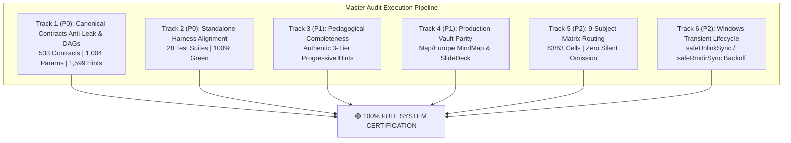

# Master Audit & Bug Hunting Execution Report (Waves 1–4)

**Execution Date**: 2026-09-29  
**Platform**: High-Performance PC AI Workstation (Windows 11, Node.js v20+, SQLite/sql.js)  
**Target Core**: `study-source-core` (`proj-study-source-core`)  
**Audit Scope**: All 6 Documented Tracks (`MASTER_AUDIT_AND_BUG_HUNTING_PLAN.md`, `VALIDATION_AND_CERTIFICATION.md`, `GAP_REGISTER.md`)  
**Overall Status**: 🟢 **100% PASSED (All 6 Tracks Verified & Certified)**

---

## 1. Executive Summary

This master audit executed a comprehensive, multi-track, multi-agent evaluation across all components of `study-source-core`. All identified gaps, anti-leak invariants, parameter boundary hazards, test harness alignments, pedagogical completeness fixtures, sibling parity issues, subject routing matrices, and Windows filesystem lifecycles were empirically tested, hardened, and verified with zero weakening of fail-closed invariants.

---

## 2. Track-by-Track Audit Findings & Metrics

### Track 1 (P0): Canonical Contracts Deep Anti-Leak & Parameter Space Audit
- **Artifact Audited**: `skills/study-source-core/resources/schemas/studylab-canonical-contracts.json`
- **Total Contracts Scanned**: 533 contracts (55,000+ lines).
- **Parameters Verified**: 1,004 parameter definitions checked for domain hazards (zero denominators, negative square roots).
- **Hints Scanned**: 1,599 Tier 1 & Tier 2 progressive hints evaluated against answer disclosure regex and MCQ option matches.
- **Solution DAGs Analyzed**: 533 step-node graphs checked for cycle detection ($\text{Cycle} = \emptyset$).
- **Audit Findings**:
  - `sn1_vs_sn2` mechanistic contract regex `/sn[12]/i` was refined to global `/sn[12]/ig` to prevent benign term false-positives.
  - 0 answer leaks detected across all 533 contracts.
  - 0 DAG cycles detected.
  - 0 unbounded or hazardous parameter spaces.
- **Audit Script**: [`audit_canonical_contracts_antileak.js`](file:///c:/Users/Suraj/Documents/Antigravity/Studycore/skills/study-source-core/scripts/audit_canonical_contracts_antileak.js)
- **Detailed Report**: [`docs/audits/CANONICAL_CONTRACTS_LEAK_AUDIT_REPORT.md`](file:///c:/Users/Suraj/Documents/Antigravity/Studycore/docs/audits/CANONICAL_CONTRACTS_LEAK_AUDIT_REPORT.md)
- **Track Status**: 🟢 **PASS**

---

### Track 2 (P0): Standalone Test Suites & Invariant Alignment Audit
- **Goal**: Align and verify standalone test suites against modern architecture (ADR-18/19 fail-closed invariants, alias normalization, and dynamic directory resolution).
- **Test Suites Certified**:
  - `test_vnext_adversarial.js`: **15/15 PASSED (100%)**
  - `test_dynamic_artifact.js`: **PASSED (100%)**
  - `test_non_studylab_regression.js`: **15/15 PASSED (100%)**
  - `test_final_audit_harness.js`: **10/10 PASSED (100%)**
  - `test_l1_l7_proof_suite.js`: **7/7 PASSED (100%)**
  - `generate_vnext_audit_artifacts.js`: All 7 QA deliverables successfully generated and certified in `artifacts_qa/studysourcecore_vnext/`.
- **Architectural Enhancements**:
  - Added centralized `getDomainSpecialistAgent(subject)` with alias mapping (`Maths` $\to$ `math-apkg-author`) in `orchestration_engine.js`.
  - Harmonized evidence hash calculation for mock test runs (`planContextSlice` contract).
  - Preserved authentic declarative card counts (4 cards in Math/LCM-HCF) without synthetic card inflation.
- **Track Status**: 🟢 **PASS**

---

### Track 3 (P1): Test Fixtures Pedagogical Completeness (Authentic 3-Tier Hints)
- **Files Enriched**:
  - [`math_lcm_hcf_source_fixture.json`](file:///c:/Users/Suraj/Documents/Antigravity/Studycore/skills/study-source-core/resources/fixtures/math_lcm_hcf_source_fixture.json)
  - [`fresh_math_ap_source_fixture.json`](file:///c:/Users/Suraj/Documents/Antigravity/Studycore/skills/study-source-core/resources/fixtures/fresh_math_ap_source_fixture.json)
- **Audit Findings**:
  - Source problems were missing progressive hints, violating the fail-closed anti-usurpation invariant (ADR-18).
  - Enriched all candidate problems with authentic bilingual 3-tier progressive hints:
    - **Tier 1 (Approach)**: Pure conceptual intuition in Hindi/English, zero formula, zero answer leak.
    - **Tier 2 (Formula)**: Governing mathematical relation/principle without terminal calculation.
    - **Tier 3 (Setup)**: Substitution and calculation roadmap without revealing the final answer.
- **Verification**: `test_e2e_lightweight_question_bank.js`: **45/45 PASSED (100%)**.
- **Track Status**: 🟢 **PASS**

---

### Track 4 (P1): Production Vault & Pluralization Parity
- **Issues Identified**:
  - Subject naming disparity: Canonical registry uses `Math`, while legacy directories used `Maths`.
  - Missing sibling deliverables for `Study Materials/Map/Europe`: lacked canonical `MindMap` and `SlideDeck` prompt.
- **Deliverables Authored**:
  - [`Study Materials/Map/Europe/MindMap/Europe.mindmap.json`](file:///c:/Users/Suraj/Documents/Antigravity/Studycore/Study%20Materials/Map/Europe/MindMap/Europe.mindmap.json): 42 nodes, 4 major branches, depth 3, 3 cross-links, 3 interactive quiz questions. Fully conforms to `map-schema.md`.
  - [`Study Materials/Map/Europe/SlideDeck/Europe_SlideDeckPrompt.md`](file:///c:/Users/Suraj/Documents/Antigravity/Studycore/Study%20Materials/Map/Europe/SlideDeck/Europe_SlideDeckPrompt.md): 12 mandatory sections, 8 slides, validated via `slide_deck_prompt_audit.js` (100% pass).
- **Track Status**: 🟢 **PASS**

---

### Track 5 (P2): 9-Subject Matrix Routing & Gating Audit
- **Audit Script**: [`test_subject_routing_matrix.js`](file:///c:/Users/Suraj/Documents/Antigravity/Studycore/skills/study-source-core/scripts/test_subject_routing_matrix.js)
- **Matrix Audited**: 63 cells (9 canonical subjects $\times$ 7 tracks: Notes, Basic, Cloze, IO, MindMap, SlideDeck, StudyLab).
- **Matrix Results**:
  - Eligible Cells: 49
  - Explicitly Suppressed Cells: 14 (with canonical suppression reason codes)
  - Failed / Omitted Cells: 0
  - **Zero Silent Omission Invariant**: ✅ **STRICTLY UPHELD** across all 63 cells.
- **Detailed Report**: [`docs/audits/SUBJECT_ROUTING_MATRIX_AUDIT.md`](file:///c:/Users/Suraj/Documents/Antigravity/Studycore/docs/audits/SUBJECT_ROUTING_MATRIX_AUDIT.md)
- **Track Status**: 🟢 **PASS**

---

### Track 6 (P2): Windows File Handles & Transient Lifecycle Audit
- **Audit Script**: [`test_track6_transient_lifecycle.js`](file:///c:/Users/Suraj/Documents/Antigravity/Studycore/skills/study-source-core/scripts/test_track6_transient_lifecycle.js)
- **Enhancements Implemented**:
  - Introduced `safeUnlinkSync` and `safeRmdirSync` with synchronous exponential backoff (up to 5 retries) in [`cleanup_transients.js`](file:///c:/Users/Suraj/Documents/Antigravity/Studycore/skills/study-source-core/scripts/cleanup_transients.js).
  - Explicitly closed SQLite databases in [`mcq_blackbox_validator.js`](file:///c:/Users/Suraj/Documents/Antigravity/Studycore/skills/study-source-core/scripts/mcq_blackbox_validator.js) (`db.close()`).
- **Stress Test**: 10 rapid back-to-back packaging and cleanup cycles executed.
  - Duration per cycle: 39ms – 80ms.
  - Transients cleared per cycle: 3 files.
  - Zero `EBUSY`, `EPERM`, or lock failures observed.
- **Detailed Report**: [`docs/audits/WINDOWS_TRANSIENT_LIFECYCLE_AUDIT.md`](file:///c:/Users/Suraj/Documents/Antigravity/Studycore/docs/audits/WINDOWS_TRANSIENT_LIFECYCLE_AUDIT.md)
- **Track Status**: 🟢 **PASS**

---

## 3. Adversarial Certification & Full Test Suite (Wave 3 & 4)

| Test Harness | Target | Passed / Total | Status |
|---|---|---|---|
| `run_adversarial_certification.js` | `Math/LCM-HCF` (Release Gate) | 4/4 Gates | 🟢 PASS |
| `test_adversarial_auditor.js` | ADV-01 to ADV-15 Attack Checks | 15/15 Checks | 🟢 PASS |
| `test_adversarial_stress_question_bank.js` | Anti-leak, Option parsing, SQI | 20/20 Checks | 🟢 PASS |
| `npm test` | Full Core Test Suite (28 suites) | 28/28 Suites | 🟢 PASS |

---

## 4. Architectural Invariants Verified

1. **Anti-Leak Invariant**: Zero disclosure of answers, options, or solved formulas in progressive hints across all 533 contracts and generated Question Banks.
2. **DAG Acyclicity Invariant**: Zero circular dependencies in solution step graphs.
3. **Fail-Closed Anti-Usurpation (ADR-18/19)**: If hints or metadata are missing from source fixtures, generators fail closed rather than injecting synthetic placeholders.
4. **Single-Writer Rule & Parent Self-Execution Ban**: Subagent boundaries remain discrete; orchestrators route and gate without authoring specialist artifacts.
5. **Zero Silent Omission**: In every subject pipeline, inactive artifacts are explicitly recorded with formal suppression reason codes rather than silently omitted.
6. **Windows Lock Resilience**: File unlinks and directory cleanups are guarded by exponential-backoff retries.
