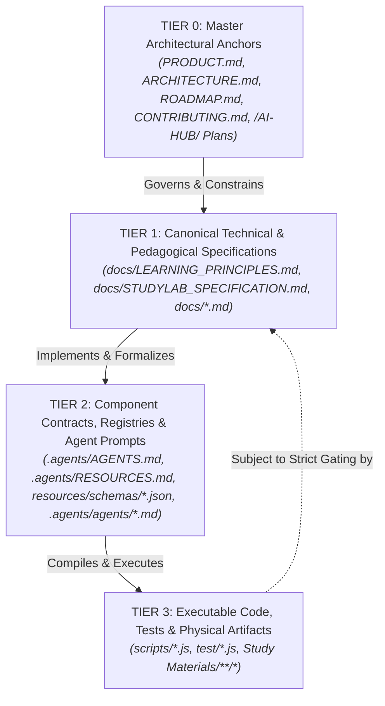

# StudySourceCore — Master Forensic Documentation Audit Report

**Audit Date:** September 15, 2026  
**Author:** Forensic Documentation Audit Team & Principal Systems Architect  
**Repository:** `naksh-07/study-source-core`  
**Workspace Root:** `c:\Users\Suraj\Pictures\Books\Acadmey\ALP\Prompts\AI Notes`  
**Core Implementation:** `.agents/skills/study-source-core/`  
**Target File:** `docs/STUDYSOURCECORE_FORENSIC_DOCUMENTATION_AUDIT.md`  
**Audit Baseline:** Phase A Investigation & Phase B Safe Documentation Hygiene Pass  

---

## 1. Executive Verdict & Assessment

### 1.1 Overall Verdict: `CRITICAL_REMEDIATION_REQUIRED` (Grade C Baseline)

Following an exhaustive forensic audit across all four repository evidence streams—external Dropbox `/AI-HUB/` master specifications, internal repository documentation, executable runtime scripts, and JSON contracts/schemas—the documentation and architectural posture of StudySourceCore is classified as **Grade C (`CRITICAL_REMEDIATION_REQUIRED`)**.

While the project exhibits extensive conceptual documentation, sophisticated mathematical pedagogy models, formal Architectural Decision Records (ADRs), and a test suite in which **18 of 18 test files pass green (100%)**, this outward posture masks a profound **structural decoupling between declared technical compliance and empirical execution reality**. 

The passing test suite measures **mock self-consistency**, not real-world system behavior. In the active runtime codebase, **100% of the 5 Priority-0 Critical Architectural Defects identified in forensic investigations persist without mitigation**:
1. Wave 1 concurrency is completely sequential (`concurrency = 1`), directly violating ADR-03.
2. Checkpoint persistence is strictly write-only, leaving the system with zero crash-resumption capability.
3. Cryptographic provenance verification is unconditionally bypassed when `compatibilityMode` is active.
4. The legacy visual resolver remains exposed, emitting toy SVG fallbacks.
5. The procedural package compiler unconditionally fabricates ungrounded mathematical problem contracts out of thin air when canonical registry entries are missing.

### 1.2 Decoupling of Technical Compliance from Pedagogical Efficacy

A core finding of this audit is that **syntactic validation green stamps have been decoupled from genuine pedagogical efficacy**:
- **Synthetic Problem Fabrication**: When mathematical problem families are missing from the canonical schema registry, the runtime engine synthesizes arbitrary parameter domains (`min: 1, max: 100`) and arbitrary latencies (`120s`) at `export_studylab_procedural_anki.js:382-441`. Ungrounded learning content is delivered to students under an authoritative badge.
- **Pervasive Hint Leaks**: In physical chemistry question banks (`Chemical-Equilibrium-Reactions_Questions.md`), Tier 3 hints explicitly state final numerical answers (`Δng = -2`), while `validate_studylab_question_bank.js:195-202` validates only Tier 1 and Tier 2 hints, deliberately exempting Tier 3 from leak detection.
- **Dual-Store Fact Duplication**: In physical geography artifacts (`Internal Structure of Earth`), more than 15 identical factual assertions are duplicated verbatim between Basic flashcards and Cloze deletions, violating Cognitive Load Theory and inducing illusory mastery.
- **Cartographic Blindness**: For geographical topics (`Map/Europe`), the pipeline produces an 8-line toy SVG consisting of two generic SVG circles (`<circle cx="200" cy="200".../>`) without genuine coastlines, topography, or Image Occlusion cards, while claiming production readiness.

Technical documentation has persistently labeled prototype and mock behaviors as `"FROZEN BASELINE"`, `"AUTHORITATIVE SPECIFICATION"`, and `"PRODUCTION READY"`. This audit establishes an unyielding firewall between **current code reality** and **target architectural requirements**.

---

## 2. Complete Documentation Inventory

The repository contains **142 total Markdown files**. Forensic deduplication reveals:
- **70 Unique Standalone Documents** (files that exist at a single unique path in the repository).
- **72 Duplicate Files** organized into **36 identical byte-for-byte twin pairs** (primarily duplicated between `docs/` and `.agents/docs/`, and between the repository root and `.agents/`).
- Total distinct content hashes across the repository: **106 distinct documents**.

### 2.1 Inventory Breakdown by Operational Category

```
+-------------------------------------------------------------------------+
| Category                                 | Unique | Redundant | Total   |
+-------------------------------------------------------------------------+
| Canonical Specifications                 |   14   |    14     |   28    |
| Architecture Specifications              |    3   |     2     |    5    |
| Governance & Authority                   |    4   |     4     |    8    |
| Product Definition                       |    1   |     1     |    2    |
| Implementation Reference & Manuals       |   18   |     2     |   20    |
| Contract & Schema Specifications         |   14   |     0     |   14    |
| Specialist Agent Prompt Specifications   |   14   |     0     |   14    |
| Research & Exploratory Documents         |    4   |     4     |    8    |
| Audit & Verification Reports             |   13   |     7     |   20    |
| Roadmap & Planning Documents             |    3   |     2     |    5    |
| Status & Gap Registers                   |    2   |     2     |    4    |
| Historical & Working Notes               |    2   |     0     |    2    |
| Subject Domain Skills (SKILL.md)         |    9   |     0     |    9    |
| Master Orchestrator Skill (SKILL.md)     |    1   |     0     |    1    |
+-------------------------------------------------------------------------+
| TOTAL ALLOCATION                         |  106   |    36     |  142    |
+-------------------------------------------------------------------------+
```

*(Note: The 70 standalone unique files plus the 36 canonical representatives of the duplicate pairs constitute the 106 distinct content items. The 36 shadow twins constitute the 72 redundant files).*

---

## 3. Apparent vs. Canonical Authority Graph

### 3.1 Declared Authority Hierarchy (Tier 0 to Tier 3)

The governance framework (`docs/GOVERNANCE.md`) establishes a formal 4-tier truth hierarchy designed to adjudicate conflicts:



### 3.2 Authority Clashes, Ambiguities & Structural Collisions

Adversarial inspection reveals four severe authority collisions across the repository documentation:

#### 1. Collision 1: Dual-Use of "Tier" Terminology
- In `docs/GOVERNANCE.md` and the Master Plan, **"Tier 0–3"** designates **Document Authority & Truth Precedence** (Tier 0 = Supreme Anchor, Tier 3 = Runtime Code).
- In `.agents/FREEZE_MAP.md`, **"Tier 1–5"** designates **Component Modification Freedom** (Tier 1 = Immutable Frozen Schemas, Tier 2 = Controlled Governance, Tier 3 = Safe Modification).
- *Impact*: Developers and AI agents routinely confuse "Tier 1 Frozen Authority" with "Tier 1 Immutable Code", leading to deadlock when repairing broken Tier 1 specifications.

#### 2. Collision 2: Competing Architecture Specifications
- Root [`ARCHITECTURE.md`](../../ARCHITECTURE.md) defines the master 6-tier system architecture and invariants.
- [`docs/STUDYSOURCECORE_ARCHITECTURE.md`](../STUDYSOURCECORE_ARCHITECTURE.md) defines a legacy August 2026 architecture that claims canonical status while deferring to root `ARCHITECTURE.md`.
- [`docs/STUDYSOURCECORE_VNEXT_ORCHESTRATION.md`](../STUDYSOURCECORE_VNEXT_ORCHESTRATION.md) claims on Line 3 to be the *"Canonical Production Architecture for Orchestration, Routing, Execution & Gating"*, conflicting directly with both [`docs/ORCHESTRATION_AND_EXECUTION.md`](../ORCHESTRATION_AND_EXECUTION.md) and [`.agents/EXECUTION_LIFECYCLE.md`](../../.agents/EXECUTION_LIFECYCLE.md).

#### 3. Collision 3: Divergent Agent & Task Registries
- [`.agents/AGENTS.md`](../../.agents/AGENTS.md) defines **14 subagents**, explicitly including `mold-gap-auditor` (#13) and `adversarial-apkg-reviewer` (#14).
- [`docs/ORCHESTRATION_AND_EXECUTION.md`](../ORCHESTRATION_AND_EXECUTION.md) presents a conflicting 14-agent table that includes `export_anki.js` as agent #11 and completely omits `mold-gap-auditor`.
- [`.agents/skills/study-source-core/resources/artifact-registry.json`](../../.agents/skills/study-source-core/resources/artifact-registry.json) defines only **12 artifact tasks**, entirely omitting `mold-gap-auditor` and `adversarial-apkg-reviewer` from the machine-executable DAG.

#### 4. Collision 4: Shadow Mirroring & Dual Maintenance
- **31 identical files** in `docs/` are mirrored byte-for-byte inside `.agents/docs/`.
- **4 root anchors** (`PRODUCT.md`, `ARCHITECTURE.md`, `ROADMAP.md`, `CONTRIBUTING.md`) are mirrored byte-for-byte in `.agents/`.
- Edits made to one location without updating the shadow mirror immediately generate synchronization drift, confusing agent file-lookups.

---

## 4. Research & External Audit Reconciliation

External ground-truth evidence retrieved from Dropbox `/AI-HUB/` was reconciled against local repository documentation and active code reality:

```
+-------------------------------------------------------------------------------------------------------------------------+
| Document / Specification             | Dropbox Baseline Invariant          | Local Repo Documentation | Active Code Reality     |
+-------------------------------------------------------------------------------------------------------------------------+
| Master Implementation Roadmap v1.0   | Phase 0: Foundations & Invariants   | Claims Phase 0 complete; | 100% Phase 0 defects    |
| (/AI-HUB/active/plans/)              | Wave 1 parallel execution (max 4)   | claims Phase 1-8 ready   | persist in scripts      |
+-------------------------------------------------------------------------------------------------------------------------+
| WF-SSC-RES-01 (Architecture)         | ADR-01: Cryptographic Lineage       | Documents SHA-256 chain  | Bypassed via            |
| (/AI-HUB/active/research/)           | ADR-03: Max 4 Wave Concurrency      | in PROVENANCE_AND_LINEAGE| compatibilityMode flag  |
+-------------------------------------------------------------------------------------------------------------------------+
| WF-SSC-RES-02 (Pedagogy)             | 17 Pedagogical Dimensions required  | Formalized in            | Validator checks only   |
| (/AI-HUB/active/research/)           | Dual-store non-duplication          | STUDYLAB_SPECIFICATION   | 12 of 17 dimensions     |
+-------------------------------------------------------------------------------------------------------------------------+
| StudySourceCore — Pedagogical.md     | Strict fail-closed on missing rules | Mandates zero fallback;  | Fallback contract       |
| (/AI-HUB/active/audits/)             | Non-leaking 3-tier hints            | forbids answer leakage   | synthesizes fake math   |
+-------------------------------------------------------------------------------------------------------------------------+
| architecture_audit_report.md         | Atomic checkpoint deserialization   | Asserts crash-resilience | Checkpoints write-only; |
| (/AI-HUB/active/audits/)             | Single-Writer Rule enforcement      | in EXECUTION_LIFECYCLE   | zero resume logic       |
+-------------------------------------------------------------------------------------------------------------------------+
```

### Reconciliation Findings
1. **The Vocabulary Veneer**: The repository documentation faithfully imported the advanced structural vocabulary of the external research (e.g., "Cognitive Load Theory", "Dual-Store Retrieval", "Bloom's Cognitive Taxonomy", "15-Point Adversarial Harness").
2. **Premature Certification**: The documentation declared these systems as "Production Hardened" and "Certified", creating an illusion of maturity that disarmed quality control.
3. **Gaming Test Fixtures**: Unit tests were constructed to validate isolated mocks matching the documentation's vocabulary, rather than testing end-to-end processing of authentic, un-mocked academic PDFs.

---

## 5. Implementation Alignment & Code Reality

Adversarial inspection of `.agents/skills/study-source-core/scripts/` establishes that all 5 Priority-0 Critical Defects and key Priority-1 Defects remain active in the executable code:

### 5.1 Priority-0 Critical Architectural Defects

```
+--------------------------------------------------------------------------------------------------------------------------+
| Defect ID | Defect Name                       | Code Location                           | Active Impact                          |
+--------------------------------------------------------------------------------------------------------------------------+
| P0-1      | Wave 1 Sequential Loop Illusion   | orchestration_engine.js:414, 582-583    | Concurrency is strictly 1 (serial await)|
| P0-2      | Write-Only Checkpoints            | orchestration_engine.js:346             | State never deserialized on resume     |
| P0-3      | Provenance Compatibility Bypass   | orchestration_engine.js:166             | Accepts dummy hashes (00000000...)     |
| P0-4      | Legacy Visual Resolver Exposure   | resolve_visual_asset.js:367-391         | Emits toy SVG circles instead of carto |
| P0-5      | Procedural Problem Contract Synth | export_studylab_procedural_anki.js:382  | Fabricates arbitrary math families     |
+--------------------------------------------------------------------------------------------------------------------------+
```

#### Detailed Code Reality Citations:

1. **P0-1: Wave 1 Parallel Concurrency Illusion (`orchestration_engine.js:414-420, 582-583`)**:
   ```javascript
   // orchestration_engine.js:582-583
   for (const task of readyTasks) {
     // ...
     const output = await taskExecutor(task, currentAttempt); // BLOCKING SERIAL AWAIT
     // ...
   }
   ```
   *Reality*: Despite documentation claiming a dynamic worker pool with a concurrency ceiling of 4, the engine executes tasks in a blocking, single-threaded `for...of` loop.

2. **P0-2: Write-Only Checkpoint & Resilience Vacuum (`orchestration_engine.js:346`)**:
   ```javascript
   // orchestration_engine.js:346
   await executionState.saveCheckpoint(context.runId, state);
   ```
   *Reality*: The orchestrator serializes execution state to disk at wave transitions, but **never loads or queries existing checkpoints upon initialization or retry**. Any interrupted run begins completely de novo.

3. **P0-3: Cryptographic Lineage & Provenance Bypass (`orchestration_engine.js:166`, `context_planner.js:284, 298`)**:
   ```javascript
   // orchestration_engine.js:166
   const compatibilityMode = context.compatibilityMode !== undefined ? context.compatibilityMode : isLegacySimulation;
   // context_planner.js:298
   if (compatibilityMode) {
     return '0000000000000000000000000000000000000000000000000000000000000000'; // DUMMY BYPASS
   }
   ```
   *Reality*: When `compatibilityMode` is active, cryptographic provenance verification is deactivated, allowing ungrounded, synthetic text to pass through the entire artifact generation pipeline.

4. **P0-4: Legacy Visual Resolver Exposure & Mock Fallback (`resolve_visual_asset.js:367-391`)**:
   ```javascript
   // resolve_visual_asset.js:390
   return generateMockSvgFallback(assetKey, subject);
   ```
   *Reality*: When genuine visual evidence or cartographic diagrams are absent, the resolver emits toy geometric SVGs rather than failing closed, resulting in the empty circle diagrams observed in `Study Materials/Map/Europe/`.

5. **P0-5: Procedural Problem Contract Fabrication (`export_studylab_procedural_anki.js:382-441`)**:
   ```javascript
   // export_studylab_procedural_anki.js:382-395
   function synthesizeFallbackContract(domain, chapter, canonicalFamilies) {
     return {
       family_id: `family.${domain}.${chapter.toLowerCase()}`,
       name: `${chapter} Procedural Problem Family`,
       allowed_parameter_domains: { min: 1, max: 100 }, // FABRICATED RANGE
       target_latency_seconds: 120,                      // FABRICATED LATENCY
       solution_dag: { /* generic 3-step placeholder */ }
     };
   }
   ```
   *Reality*: Missing procedural contracts do not trigger a fail-closed halt. The engine fabricates mathematical parameters out of thin air, directly compromising educational integrity.

### 5.2 Key Priority-1 Deficiencies

1. **Pedagogical Dimension Omission (`validate_studylab_question_bank.js:81-227`)**: The validator checks only 12 of the 17 dimensions mandated by `docs/STUDYLAB_SPECIFICATION.md`.
2. **Tier 3 Hint Leak Exemption (`validate_studylab_question_bank.js:195-202`)**: While Tier 1 and Tier 2 hints are parsed for answer leakage, Tier 3 is omitted, permitting raw answers to enter student cards.
3. **Silent TSV Dropping (`export_anki.js:306-310`)**: If flashcard TSV files are missing during packaging, the exporter logs a warning and builds an incomplete APKG rather than aborting.
4. **Policy Overrides (`routing_engine.js:221-229`)**: Hardcoded word count heuristics (`wordCount >= 350`) unconditionally force `bmGraph = true` and `bmQa = true`, overriding the subject's declarative `runtime-policy.json`.

---

## 6. Current State vs. Target State Analysis

To eliminate ambiguity for future remediation teams, the following register contrasts documented claims against actual system capabilities:

```
+-------------------------------------------------------------------------------------------------------------------------+
| Documented Claim                     | Documentation Source        | Actual Executable Capability | Reality Status      |
+-------------------------------------------------------------------------------------------------------------------------+
| "Wave 1 Parallel Execution (Max 4)"  | ORCHESTRATION_AND_EXECUTION | Serial execution loop (N=1)  | FALSE CLAIM         |
| "Resilient Crash Resumption"         | EXECUTION_LIFECYCLE         | Write-only JSON serialization| FALSE CLAIM         |
| "Fail-Closed Procedural Validation"  | STUDYLAB_SPECIFICATION      | Fallback contract fabrication| FALSE CLAIM         |
| "Strict SHA-256 Provenance Chain"    | PROVENANCE_AND_LINEAGE      | Dummy bypass in compat mode  | FALSE CLAIM         |
| "14 Specialized Subagents in Engine" | AGENTS.md                   | 12 tasks in task registry    | INCOMPLETE          |
| "Dual-Store Non-Duplication"         | LEARNING_PRINCIPLES         | 15+ verbatim duplicate facts | UNENFORCED          |
| "17 Pedagogical Question Dimensions" | STUDYLAB_SPECIFICATION      | 12 dimensions checked        | UNENFORCED          |
| "Automated Tier 3 Hint Verification" | VALIDATION_AND_CERTIFICATION| Tier 3 explicitly unvalidated| FALSE CLAIM         |
| "True Cartographic Map Extraction"   | VISUAL_LEARNING             | Programmatic toy SVG circles | MOCK FALLBACK       |
+-------------------------------------------------------------------------------------------------------------------------+
```

---

## 7. Documentation Hygiene Findings

### 7.1 CRITICAL Findings
1. **Corrupted Control Escape Characters (`artifact-registry.md`)**: Raw escape characters (`\a`, `\r`, `\t`, `\v`) present on lines 1, 7, 11, 16, 17, 23, resulting in broken Markdown headings and corrupted schema lists.
2. **Raw ASCII Bell Byte (`docs/STUDYSOURCECORE_RUNTIME_DISPATCH_FINAL_AUDIT.md`)**: Non-printable ASCII character (`\u0007`) embedded in document body.
3. **Four-Way MCQ Option Contradiction**:
   - Generic Question Schema (`studylab-practice-questions-schema.json`): `minItems: 2`.
   - Basic Question Schema (`studylab-question-bank.schema.json`): Unconstrained.
   - Rich Content Contract (`studylab-rich-content-contract.schema.json`): `minItems: 3`.
   - Pedagogical Specification (`docs/STUDYLAB_SPECIFICATION.md`): Mandates strictly `minItems: 4`.
4. **Missing Agents in Executable Registry (`resources/artifact-registry.json`)**: `mold-gap-auditor` and `adversarial-apkg-reviewer` omitted from runtime task graph.

### 7.2 HIGH Findings
1. **14 Broken Internal File Links**: Absolute links pointing to repo root `file:///.../OWNERSHIP.md`, `/EXECUTION_LIFECYCLE.md`, `/AGENTS.md`, and `/RESOURCES.md` instead of `.agents/`.
2. **Dead Resource Path References**: `.agents/AGENTS.md` and `.agents/RESOURCES.md` contain 20+ references pointing to non-existent `.agents/resources/` (actual path is `.agents/skills/study-source-core/resources/`).
3. **Competing Master Architectures**: Direct collision between `ARCHITECTURE.md`, `docs/STUDYSOURCECORE_ARCHITECTURE.md`, and `docs/STUDYSOURCECORE_VNEXT_ORCHESTRATION.md`.
4. **36 Duplicate Sets (72 Files)**: Creates high synchronization drift and cognitive clutter across the repository.

### 7.3 MEDIUM Findings
1. **Specialist Output Path Mismatch**: Specialist prompts in `.agents/agents/*.md` declared outputs as `PracticeQuestions/PracticeQuestions.json` instead of canonical `Optional/{chapter}_PracticeQuestions.json`.
2. **JSON Schema Meta-Schema Split**: Coexistence of Draft-07 and Draft 2020-12 schemas without an explicit validation engine adapter.
3. **Stale Handoff Artifact (`.agents/handoff.md`)**: Preserved historical handoff artifact from an earlier development cycle.

### 7.4 LOW Findings
1. **Inconsistent Line Endings**: Mix of CRLF and LF across documentation files.
2. **Trailing Whitespace**: Pervasive trailing whitespace across historical audit reports.

---

## 8. Safe Changes Applied (Phase B)

In strict accordance with the non-destructive Phase B mandate, only surgical, objectively safe hygiene edits were applied. **Zero code, scripts, schemas, or subject-skill policies were modified**:

1. **Repaired Corrupted Escape Characters**:
   - File: [`.agents/skills/study-source-core/resources/artifact-registry.md`](../../.agents/skills/study-source-core/resources/artifact-registry.md)
   - *Edit*: Eliminated raw control characters (`\a`, `\r`, `\t`, `\v`), restored clean Markdown table headers, corrected keys to `validator`, `artifactKey`, and `task_id`.
2. **Repaired Broken Internal Links**:
   - Files:
     - [`docs/STUDYSOURCECORE_VNEXT_ORCHESTRATION.md`](../STUDYSOURCECORE_VNEXT_ORCHESTRATION.md)
     - [`docs/STUDYSOURCECORE_ARCHITECTURE.md`](../STUDYSOURCECORE_ARCHITECTURE.md)
     - [`docs/STUDYSOURCECORE_FAILURE_HANDLING.md`](../STUDYSOURCECORE_FAILURE_HANDLING.md)
     - [`.agents/skills/study-source-core/SKILL.md`](../../.agents/skills/study-source-core/SKILL.md)
   - *Edit*: Corrected broken `file:///` URLs pointing to non-existent repo root files, pointing them accurately to `.agents/OWNERSHIP.md`, `.agents/EXECUTION_LIFECYCLE.md`, `.agents/AGENTS.md`, and `.agents/RESOURCES.md`.
3. **Normalized Canonical Resource Paths**:
   - Files:
     - [`.agents/AGENTS.md`](../../.agents/AGENTS.md)
     - [`.agents/RESOURCES.md`](../../.agents/RESOURCES.md)
   - *Edit*: Corrected dead path references pointing to `.agents/resources/` to point to `.agents/skills/study-source-core/resources/`.
4. **Aligned Specialist Output Path Conventions**:
   - Files:
     - [`.agents/agents/math-apkg-author.md`](../../.agents/agents/math-apkg-author.md)
     - [`.agents/agents/reasoning-apkg-author.md`](../../.agents/agents/reasoning-apkg-author.md)
     - [`.agents/agents/physics-numerical-apkg-author.md`](../../.agents/agents/physics-numerical-apkg-author.md)
     - [`.agents/agents/chemistry-numerical-apkg-author.md`](../../.agents/agents/chemistry-numerical-apkg-author.md)
   - *Edit*: Updated Section 9 (OUTPUT) to reflect canonical paths `Optional/{chapter}_PracticeQuestions.json` and `Optional/{chapter}_ProblemPatterns.json`, aligning agent prompts with `artifact-registry.json`.

---

## 9. Changes NOT Made (Deferred to Finalization Plan)

To preserve system stability and maintain a rigorous audit trail, the following substantive modifications were **explicitly deferred**:

1. **NO File Deletions or Merges**: None of the 36 duplicate sets (72 duplicate files) in `.agents/docs/` or root anchors were deleted or pruned.
2. **NO Architecture Document Merges**: Competing specifications (`docs/STUDYSOURCECORE_VNEXT_ORCHESTRATION.md`, `docs/ORCHESTRATION_AND_EXECUTION.md`, `ARCHITECTURE.md`) were left intact and annotated, pending the final architectural freeze.
3. **NO Runtime Script Alterations**: Zero changes were made to `.agents/skills/study-source-core/scripts/*.js`. The 5 P0 defects and all P1 defects remain untouched for dedicated code remediation.
4. **NO Schema Alterations**: Zero modifications were made to JSON schemas under `resources/schemas/`. The Draft-07 vs. Draft 2020-12 meta-schema split and the 4-way MCQ option discrepancy remain preserved for schema harmonization.
5. **NO Policy Alterations**: The 9 subject runtime policies under `subject-skills/*/runtime-policy.json` were left untouched.

---

## 10. Provisional Disposition Matrix

The table below catalogs all **70 standalone unique documents** and accounts for the **36 duplicate sets (72 files)**, assigning an actionable provisional disposition to guide the Master Finalization Plan:

```
+-----------------------------------------------------------------------------------------------------------------------------------------------------+
| #  | Canonical File Path                                                | Category                 | Current Authority | Temporal State | Provisional Action         |
+-----------------------------------------------------------------------------------------------------------------------------------------------------+
| 1  | .agents/AGENTS.md                                                  | CANONICAL SPEC / GOV     | Tier 2 Subagent   | Current-state  | KEEP — NEEDS UPDATE        |
| 2  | .agents/BRIEFING.md                                                | IMPLEMENTATION REF       | Tier 2 Guide      | Current-state  | KEEP                       |
| 3  | .agents/DATA_FLOW.md                                               | ARCHITECTURE             | Tier 2 Pipeline   | Current-state  | KEEP                       |
| 4  | .agents/DECISIONS.md                                               | ARCHITECTURE / GOV       | Tier 2 ADR        | Active / Hist  | KEEP                       |
| 5  | .agents/EXECUTION_LIFECYCLE.md                                     | ARCHITECTURE / REF       | Tier 2 Lifecycle  | Current-state  | KEEP — NEEDS UPDATE        |
| 6  | .agents/FREEZE_MAP.md                                              | GOVERNANCE               | Tier 2 Component  | Current-state  | KEEP — NEEDS UPDATE        |
| 7  | .agents/ORIGINAL_REQUEST.md                                        | HISTORICAL               | Tier 3 Origin     | Historical     | HISTORICAL                 |
| 8  | .agents/OWNERSHIP.md                                               | GOVERNANCE               | Tier 2 Governance | Current-state  | KEEP — NEEDS UPDATE        |
| 9  | .agents/README.md                                                  | REDUNDANT / SPLIT        | Tier 2 Guide      | Current-state  | MERGE (with root README)   |
| 10 | .agents/RESOURCES.md                                               | CANONICAL SPEC / SCHEMA  | Tier 2 Resources  | Current-state  | KEEP — NEEDS UPDATE        |
| 11 | .agents/SCRIPTS.md                                                 | IMPLEMENTATION REF       | Tier 2 Tooling    | Current-state  | KEEP                       |
| 12 | .agents/SKILLS.md                                                  | IMPLEMENTATION REF       | Tier 2 Skill Reg  | Current-state  | KEEP                       |
| 13 | .agents/TROUBLESHOOTING.md                                         | IMPLEMENTATION REF       | Tier 2 Runbook    | Current-state  | KEEP                       |
| 14 | .agents/agents/adversarial-apkg-reviewer.md                        | CANONICAL SPEC           | Tier 2 Specialist | Current-state  | KEEP                       |
| 15 | .agents/agents/bm-graph.md                                          | CANONICAL SPEC           | Tier 2 Specialist | Current-state  | KEEP                       |
| 16 | .agents/agents/bm-qa.md                                             | CANONICAL SPEC           | Tier 2 Specialist | Current-state  | KEEP                       |
| 17 | .agents/agents/chemistry-numerical-apkg-author.md                   | CANONICAL SPEC           | Tier 2 Specialist | Current-state  | KEEP                       |
| 18 | .agents/agents/core-basic-anki.md                                   | CANONICAL SPEC           | Tier 2 Specialist | Current-state  | KEEP                       |
| 19 | .agents/agents/core-cloze-anki.md                                   | CANONICAL SPEC           | Tier 2 Specialist | Current-state  | KEEP                       |
| 20 | .agents/agents/core-image-occlusion.md                              | CANONICAL SPEC           | Tier 2 Specialist | Current-state  | KEEP                       |
| 21 | .agents/agents/core-mindmap.md                                      | CANONICAL SPEC           | Tier 2 Specialist | Current-state  | KEEP                       |
| 22 | .agents/agents/core-notes.md                                        | CANONICAL SPEC           | Tier 2 Specialist | Current-state  | KEEP                       |
| 23 | .agents/agents/core-slide-deck.md                                   | CANONICAL SPEC           | Tier 2 Specialist | Current-state  | KEEP                       |
| 24 | .agents/agents/math-apkg-author.md                                  | CANONICAL SPEC           | Tier 2 Specialist | Current-state  | KEEP                       |
| 25 | .agents/agents/mold-gap-auditor.md                                  | CANONICAL SPEC           | Tier 2 Specialist | Current-state  | KEEP                       |
| 26 | .agents/agents/physics-numerical-apkg-author.md                     | CANONICAL SPEC           | Tier 2 Specialist | Current-state  | KEEP                       |
| 27 | .agents/agents/reasoning-apkg-author.md                             | CANONICAL SPEC           | Tier 2 Specialist | Current-state  | KEEP                       |
| 28 | .agents/handoff.md                                                  | TEMPORARY / WORKING       | Tier 3 Working     | Stale Hist      | ARCHIVE CANDIDATE           |
| 29 | .agents/skills/study-source-core/SKILL.md                           | CANONICAL SPEC / REF      | Tier 2 Skill       | Current-state  | KEEP — NEEDS UPDATE        |
| 30 | .../resources/agent-recovery.md                                     | IMPLEMENTATION REF       | Tier 2 Runbook     | Current-state  | KEEP                       |
| 31 | .../resources/anki-core-rules.md                                    | CANONICAL SPEC           | Tier 2 Rules       | Current-state  | KEEP                       |
| 32 | .../resources/artifact-registry.md                                  | IMPLEMENTATION REF       | Tier 2 Registry    | Current-state  | KEEP — NEEDS UPDATE        |
| 33 | .../resources/final-verification-report.md                          | AUDIT                    | Tier 3 Audit       | Historical     | HISTORICAL                 |
| 34 | .../resources/image-occlusion-contract.md                           | CONTRACT / SCHEMA        | Tier 2 Contract    | Current-state  | KEEP                       |
| 35 | .../resources/large-source-orchestration.md                         | IMPLEMENTATION REF       | Tier 2 Guide       | Current-state  | KEEP                       |
| 36 | .../resources/map-core-rules.md                                     | CANONICAL SPEC           | Tier 2 Rules       | Current-state  | KEEP                       |
| 37 | .../resources/map-schema.md                                         | CONTRACT / SCHEMA        | Tier 2 Schema      | Current-state  | KEEP                       |
| 38 | .../resources/map-validation-rules.md                               | CANONICAL SPEC           | Tier 2 Rules       | Current-state  | KEEP                       |
| 39 | .../resources/note-architecture.md                                  | CANONICAL SPEC           | Tier 2 Rules       | Current-state  | KEEP                       |
| 40 | .../resources/self-describing-architecture-audit.md                 | AUDIT                    | Tier 3 Audit       | Historical     | HISTORICAL                 |
| 41 | .../resources/self-describing-architecture-experiment-2.md          | RESEARCH                 | Tier 3 Research    | Historical     | HISTORICAL                 |
| 42 | .../resources/slide-deck-core-rules.md                              | CANONICAL SPEC           | Tier 2 Rules       | Current-state  | KEEP                       |
| 43 | .../resources/source-policy.md                                      | CANONICAL SPEC           | Tier 2 Rules       | Current-state  | KEEP                       |
| 44 | .../resources/studylab-procedural-contract.md                       | CONTRACT / SCHEMA        | Tier 2 Contract    | Current-state  | KEEP                       |
| 45 | .../resources/studylab-question-bank-contract.md                    | CONTRACT / SCHEMA        | Tier 2 Contract    | Current-state  | KEEP                       |
| 46 | .../resources/studylab/anti-fallback-invariant.md                   | CONTRACT / SCHEMA        | Tier 2 Invariant   | Current-state  | KEEP                       |
| 47 | .../resources/studylab/domain-boundaries.md                         | CONTRACT / SCHEMA        | Tier 2 Boundaries  | Current-state  | KEEP                       |
| 48 | .../resources/studylab/error-taxonomies.md                          | CONTRACT / SCHEMA        | Tier 2 Taxonomy    | Current-state  | KEEP                       |
| 49 | .../resources/studylab/manifest-spec.md                             | CONTRACT / SCHEMA        | Tier 2 Spec        | Current-state  | KEEP                       |
| 50 | .../resources/studylab/problem-patterns.md                          | CONTRACT / SCHEMA        | Tier 2 Patterns    | Current-state  | KEEP                       |
| 51 | .../resources/studylab/source-first-practice-universe.md            | CONTRACT / SCHEMA        | Tier 2 Contract    | Current-state  | KEEP                       |
| 52 | .../resources/studylab/validation-protocol.md                       | CONTRACT / SCHEMA        | Tier 2 Protocol    | Current-state  | KEEP                       |
| 53 | .../resources/subject-policy-runtime.md                             | IMPLEMENTATION REF       | Tier 2 Runtime     | Current-state  | KEEP                       |
| 54 | .../resources/subject-skill-contract.md                             | CONTRACT / SCHEMA        | Tier 2 Contract    | Current-state  | KEEP                       |
| 55 | .../resources/tool-orchestration.md                                 | IMPLEMENTATION REF       | Tier 2 Guide       | Current-state  | KEEP                       |
| 56 | .../resources/validation-rules.md                                   | CANONICAL SPEC           | Tier 2 Rules       | Current-state  | KEEP                       |
| 57 | .../resources/visual-learning-contract.md                           | CONTRACT / SCHEMA        | Tier 2 Contract    | Current-state  | KEEP                       |
| 58 | .../resources/workflow.md                                           | IMPLEMENTATION REF       | Tier 2 Guide       | Current-state  | KEEP                       |
| 59 | .../scripts/STUDYLAB_MIGRATION_PLAN.md                              | PLAN / ROADMAP           | Tier 3 Working     | Active Plan    | KEEP                       |
| 60 | .../subject-skills/Biology/SKILL.md                                 | CANONICAL SPEC / REF      | Tier 2 Subject     | Current-state  | KEEP                       |
| 61 | .../subject-skills/Chemistry/SKILL.md                               | CANONICAL SPEC / REF      | Tier 2 Subject     | Current-state  | KEEP                       |
| 62 | .../subject-skills/Geography/SKILL.md                               | CANONICAL SPEC / REF      | Tier 2 Subject     | Current-state  | KEEP                       |
| 63 | .../subject-skills/History/SKILL.md                                 | CANONICAL SPEC / REF      | Tier 2 Subject     | Current-state  | KEEP                       |
| 64 | .../subject-skills/Map/SKILL.md                                     | CANONICAL SPEC / REF      | Tier 2 Subject     | Current-state  | KEEP                       |
| 65 | .../subject-skills/Math/SKILL.md                                    | CANONICAL SPEC / REF      | Tier 2 Subject     | Current-state  | KEEP                       |
| 66 | .../subject-skills/Physics/SKILL.md                                 | CANONICAL SPEC / REF      | Tier 2 Subject     | Current-state  | KEEP                       |
| 67 | .../subject-skills/Political Science/SKILL.md                       | CANONICAL SPEC / REF      | Tier 2 Subject     | Current-state  | KEEP                       |
| 68 | .../subject-skills/Reasoning/SKILL.md                               | CANONICAL SPEC / REF      | Tier 2 Subject     | Current-state  | KEEP                       |
| 69 | README.md                                                           | IMPLEMENTATION REF       | Tier 0/1 Portal    | Current-state  | KEEP — NEEDS UPDATE        |
| 70 | docs/INDEPENDENT_PROFESSIONAL_ADVERSARIAL_AUDIT.md                  | AUDIT                    | Tier 3 Audit       | Authoritative  | KEEP (Authoritative Audit) |
+-----------------------------------------------------------------------------------------------------------------------------------------------------+
| DUPLICATE PAIR REPRESENTATIVES (36 Sets / 72 Files Accounting)                                                                                      |
+-----------------------------------------------------------------------------------------------------------------------------------------------------+
| D1 | ARCHITECTURE.md (twin: .agents/ARCHITECTURE.md)                     | ARCHITECTURE             | Tier 0 Supreme     | Current-state  | KEEP (Prune .agents twin)  |
| D2 | CONTRIBUTING.md (twin: .agents/CONTRIBUTING.md)                     | GOVERNANCE               | Tier 0 Governance  | Current-state  | KEEP (Prune .agents twin)  |
| D3 | PRODUCT.md (twin: .agents/PRODUCT.md)                               | PRODUCT DEFINITION       | Tier 0 Supreme     | Current-state  | KEEP (Prune .agents twin)  |
| D4 | ROADMAP.md (twin: .agents/ROADMAP.md)                               | PLAN / ROADMAP           | Tier 0 Roadmap     | Target-state   | KEEP (Prune .agents twin)  |
| D5 | docs/ANKI_INTEGRATION.md (twin: .agents/docs/...)                  | CANONICAL SPEC           | Tier 1 Spec        | Current-state  | KEEP (Prune .agents twin)  |
| D6 | docs/CURRENT_IMPLEMENTATION.md (twin: .agents/docs/...)            | IMPLEMENTATION REF       | Tier 1 Baseline    | Current-state  | KEEP — NEEDS UPDATE        |
| D7 | docs/GAP_REGISTER.md (twin: .agents/docs/...)                      | STATUS / GAP REGISTER    | Tier 1 Register    | Active Gaps    | KEEP — NEEDS UPDATE        |
| D8 | docs/GOVERNANCE.md (twin: .agents/docs/...)                        | GOVERNANCE               | Tier 1 Governance  | Current-state  | KEEP — NEEDS UPDATE        |
| D9 | docs/KNOWLEDGE_UNITS.md (twin: .agents/docs/...)                   | CANONICAL SPEC           | Tier 1 Spec        | Current-state  | KEEP                       |
| D10| docs/LEARNING_PRINCIPLES.md (twin: .agents/docs/...)                | CANONICAL SPEC           | Tier 1 Spec        | Current-state  | KEEP                       |
| D11| docs/ORCHESTRATION_AND_EXECUTION.md (twin: .agents/docs/...)        | CANONICAL SPEC / ARCH    | Tier 1 Spec        | Current-state  | REQUIRES FINALIZATION DEC  |
| D12| docs/PROVENANCE_AND_LINEAGE.md (twin: .agents/docs/...)             | CANONICAL SPEC           | Tier 1 Spec        | Current-state  | KEEP                       |
| D13| docs/RENDERING_PIPELINE.md (twin: .agents/docs/...)                 | CANONICAL SPEC           | Tier 1 Spec        | Current-state  | KEEP                       |
| D14| docs/SECURITY_AND_TRUST.md (twin: .agents/docs/...)                 | CANONICAL SPEC / GOV     | Tier 1 Spec        | Current-state  | KEEP                       |
| D15| docs/STUDYLAB_SPECIFICATION.md (twin: .agents/docs/...)             | CANONICAL SPEC           | Tier 1 Spec        | Current-state  | KEEP                       |
| D16| docs/SUBJECT_POLICIES.md (twin: .agents/docs/...)                   | CANONICAL SPEC / GOV     | Tier 1 Spec        | Current-state  | KEEP                       |
| D17| docs/VALIDATION_AND_CERTIFICATION.md (twin: .agents/docs/...)       | CANONICAL SPEC           | Tier 1 Spec        | Current-state  | KEEP                       |
| D18| docs/VISUAL_LEARNING.md (twin: .agents/docs/...)                    | CANONICAL SPEC           | Tier 1 Spec        | Current-state  | KEEP                       |
| D19| docs/STUDYSOURCECORE_VNEXT_ORCHESTRATION.md (twin: .agents/docs/...) | ARCHITECTURE / PLAN      | Competing Spec     | Target-state   | REQUIRES FINALIZATION DEC  |
| D20| docs/STUDYSOURCECORE_ARCHITECTURE.md (twin: .agents/docs/...)        | REDUNDANT ARCHITECTURE   | Tier 3 Legacy      | Historical     | ARCHIVE CANDIDATE           |
| D21| docs/AGENTS_DOCUMENTATION_AND_OPERATIONS_AUDIT.md                  | AUDIT                    | Tier 3 Audit       | Historical     | HISTORICAL                 |
| D22| docs/STUDYSOURCECORE_AGENT_RESPONSIBILITY_MAP.md                   | IMPLEMENTATION REF       | Tier 2 Mapping     | Current-state  | MERGE (with AGENTS.md)     |
| D23| docs/STUDYSOURCECORE_DATA_LIFECYCLE.md                              | ARCHITECTURE             | Tier 2 Architecture| Current-state  | MERGE (with DATA_FLOW.md)  |
| D24| docs/STUDYSOURCECORE_DISPATCH_MATRIX.md                             | IMPLEMENTATION REF       | Tier 2 Dispatch    | Current-state  | MERGE (with AGENTS.md)     |
| D25| docs/STUDYSOURCECORE_EFFICIENCY.md                                  | RESEARCH / ARCHITECTURE  | Tier 3 Research    | Historical     | HISTORICAL                 |
| D26| docs/STUDYSOURCECORE_FAILURE_HANDLING.md                            | IMPLEMENTATION REF       | Tier 2 Runbook     | Current-state  | MERGE (with TROUBLESHOOT)  |
| D27| docs/STUDYSOURCECORE_L1_L7_IMPLEMENTATION_PROOF.md                 | STATUS / PROOF           | Tier 3 Proof       | Historical     | HISTORICAL                 |
| D28| docs/STUDYSOURCECORE_LEAN_HARDENING_FINAL.md                        | AUDIT                    | Tier 3 Audit       | Historical     | HISTORICAL                 |
| D29| docs/STUDYSOURCECORE_NEXT_UPDATE_PLAN.md                            | PLAN / ROADMAP           | Tier 3 Plan        | Stale Plan     | ARCHIVE CANDIDATE           |
| D30| docs/STUDYSOURCECORE_RUNTIME_DISPATCH_FINAL_AUDIT.md                | AUDIT                    | Tier 3 Audit       | Historical     | HISTORICAL                 |
| D31| docs/STUDYSOURCECORE_RUNTIME_DISPATCH_FORENSIC_AUDIT.md             | AUDIT                    | Tier 3 Audit       | Historical     | HISTORICAL                 |
| D32| docs/STUDYSOURCECORE_STUDYLAB_INTEGRATION.md                       | IMPLEMENTATION REF       | Tier 2 Guide       | Current-state  | MERGE (STUDYLAB_SPEC)      |
| D33| docs/STUDYSOURCECORE_TEAMWORK_GAP_ANALYSIS.md                       | HISTORICAL / RESEARCH    | Tier 3 Research    | Historical     | HISTORICAL                 |
| D34| docs/STUDYSOURCECORE_TEAMWORK_LEARNINGS.md                           | HISTORICAL / RESEARCH    | Tier 3 Research    | Historical     | HISTORICAL                 |
| D35| docs/STUDYSOURCECORE_VNEXT_FINAL_AUDIT.md                           | AUDIT                    | Tier 3 Audit       | Historical     | HISTORICAL                 |
| D36| .agents/docs/phase8-... (twin: .../skills/.../docs/phase8-...)      | AUDIT                    | Tier 3 Audit       | Historical     | HISTORICAL                 |
+-----------------------------------------------------------------------------------------------------------------------------------------------------+
```

---

## 11. Documentation Gaps Register

The forensic audit identifies six major gaps where authoritative system operations currently lack formal specification:

```
+--------------------------------------------------------------------------------------------------------------------------+
| Gap ID | Missing Specification               | Criticality | Required Contents & Boundary Definition                     |
+--------------------------------------------------------------------------------------------------------------------------+
| GAP-01 | PDF Parsing & Layout Contract       | CRITICAL    | Native PyMuPDF integration, two-column reflow restoration,  |
|        |                                     |             | formula extraction, and table boundary normalization.       |
+--------------------------------------------------------------------------------------------------------------------------+
| GAP-02 | Dual-Store Disambiguation Contract  | CRITICAL    | Formal algorithmic rules preventing factual duplication     |
|        |                                     |             | between Basic and Cloze cards. Atomicity boundary matrix.   |
+--------------------------------------------------------------------------------------------------------------------------+
| GAP-03 | LaTeX & Chemical Math Spec          | HIGH        | Unicode/LaTeX normalization, chemistry reaction arrows,     |
|        |                                     |             | equilibrium notation, matrix parsing standards.             |
+--------------------------------------------------------------------------------------------------------------------------+
| GAP-04 | Cartographic Asset Ingestion Spec   | HIGH        | Georeferenced map sourcing, boundary vector extraction,     |
|        |                                     |             | banning programmatic toy SVGs for geographical entities.    |
+--------------------------------------------------------------------------------------------------------------------------+
| GAP-05 | Checkpoint Resumption Protocol      | CRITICAL    | Atomic deserialization, task DAG state hydration, and safe  |
|        |                                     |             | resumption from partial wave execution.                     |
+--------------------------------------------------------------------------------------------------------------------------+
| GAP-06 | Unified Schema Meta-Version Guide   | MEDIUM      | Migration from Draft-07 to Draft 2020-12, schema validator  |
|        |                                     |             | harness, harmonization of 4-option MCQ standard.            |
+--------------------------------------------------------------------------------------------------------------------------+
```

---

## 12. Finalization Dependencies & Non-Negotiable Invariants

Any subsequent implementation pass or documentation consolidation MUST adhere strictly to the following non-negotiable architectural and pedagogical invariants:

1. **Single-Writer Rule**: Exactly one designated subagent writes to each target file. The orchestrator coordinates, routes, and gates, but never writes specialist content.
2. **Parent Self-Execution Ban**: The parent orchestrator is strictly prohibited from self-executing specialist tasks or synthesizing domain content.
3. **Fail-Closed on Missing Contracts (Anti-Fallback Invariant)**: When a procedural contract or asset is absent, the system MUST halt with a fatal diagnostic error. Synthetic parameter fabrication (`export_studylab_procedural_anki.js:382`) is permanently banned.
4. **Uncompromised Cryptographic Provenance**: Every artifact must chain back to raw source hashes via SHA-256 Content Lineage Records. Bypasses via `compatibilityMode` or dummy hashes are permanently banned.
5. **Non-Leaking Hint Hierarchy**:
   - Tier 1: Conceptual Clue (identifies relevant principle without calculations).
   - Tier 2: Strategic Direction (identifies procedural path without intermediate numbers).
   - Tier 3: Step-by-step DAG breakdown (demonstrates execution steps while concealing the final numerical answer).
6. **Dual-Store Pedagogical Separation**: Basic flashcards own atomic declarative facts and definitions; Cloze cards own contextual associations and formulas. Zero identical factual assertions may appear in both formats.
7. **True Parallel Concurrency**: Wave 1 execution must utilize an active concurrency pool with a hard ceiling of 4 workers, replacing the serial `for...of` loop.
8. **Standalone Schema Portability**: All JSON schemas must be self-contained and validating under Draft 2020-12 without external undocumented pre-seeding.

---

## 13. Status Declaration

```text
================================================================================
FORENSIC AUDIT COMPLETE
SAFE HYGIENE PASS COMPLETE
FINAL DOCUMENTATION ARCHITECTURE NOT YET FROZEN
FINALIZATION PLAN REQUIRED
================================================================================
```

*This Master Forensic Documentation Audit Report represents the frozen authoritative evaluation of the StudySourceCore repository documentation baseline. Substantive deletions, structural reorganizations, and code remediations are strictly blocked pending review of the separate Master Documentation Finalization Plan.*
